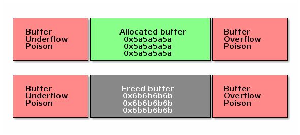

* [目次](/README.md#目次index)
* [対称型マルチプロセッシング](/smp.rst.md#対称型マルチプロセッシング)

---

## デバッグ


### この講義の目的

Linux カーネル開発に不可欠なものの一つがデバッグです。
ユーザ空間ではカーネルのサポートがあったので、簡単にプロセスを停止して ``gdb`` でプロセスの動きを詳しく調べることができました。
カーネル空間の場合、``gdb`` を使うためには ``QEMU`` や ``JTAG`` 系のハードウェア・インタフェースなど、常に利用できるとは限らないハイパーバイザを使う必要があります。
Linux カーネルは異常な挙動を調査するために役に立つ一連のツールやデバッグ・オプションを提供しています。

この講義では以下について学習します：

   * [oops/panic の解読](/debugging.rst.md#oopspanic-の解読)

   * [リストのデバッグ](/debugging.rst.md#リスト型のデバッグ)
   
   * [メモリのデバッグ](/debugging.rst.md#メモリのデバッグ)
   
   * [ロックのデバッグ](/debugging.rst.md#Lockdep-チェッカ)
   
   * [プロファイリング](/debugging.rst.md#perf)


### oops/panic の解読

``oops`` とはカーネル内部の「矛盾した」状態を意味し、カーネル自身が検出します。
``oops`` を検出すると、Linux カーネルは問題を引き起こしたプロセスを強制終了して、その問題のデバッグに役立つ情報を出力し、カーネルの実行を継続しますが、その挙動は保証されたものでありません。

次に示す Linux カーネル・モジュールについて考えてみることにしましょう：

```c
      static noinline void do_oops(void)
      {
          *(int*)0x42 = 'a';
      }

      static int so2_oops_init(void)
      {
          pr_info("oops_init\n");
          do_oops();

          return 0;
      }

      static void so2_oops_exit(void)
      {
          pr_info("oops exit\n");
      }

      module_init(so2_oops_init);
      module_exit(so2_oops_exit);
```

``do_oops()`` 関数で無効なアドレスのメモリに書き込もうとしていることに注意して下さい。
カーネルは正しく書き込める妥当な物理ページであるかどうかを見分けることはできないので、``do_oops()`` 関数を実行しているコンテキストで ``insmod`` の命令を強制終了します。
それから、次のような oops メッセージを出力します：

```bash

      root@qemux86:~/skels/debugging/oops# insmod oops.ko
      BUG: unable to handle kernel NULL pointer dereference at 00000042
      IP: do_oops+0x8/0x10 [oops]
      *pde = 00000000
      Oops: 0002 [#1] SMP
      Modules linked in: oops(O+)
      CPU: 0 PID: 234 Comm: insmod Tainted: G           O     4.15.0+ #3
      Hardware name: QEMU Standard PC (i440FX + PIIX, 1996), BIOS Ubuntu-1.8.2-1ubuntu1 04/01/2014
      EIP: do_oops+0x8/0x10 [oops]
      EFLAGS: 00000292 CPU: 0
      EAX: 00000061 EBX: 00000000 ECX: c7ed3584 EDX: c7ece8dc
      ESI: c716c908 EDI: c8816010 EBP: c7257df0 ESP: c7257df0
      DS: 007b ES: 007b FS: 00d8 GS: 0033 SS: 0068
      CR0: 80050033 CR2: 00000042 CR3: 0785f000 CR4: 00000690
      Call Trace:
      so2_oops_init+0x17/0x20 [oops]
      do_one_initcall+0x37/0x170
      ? cache_alloc_debugcheck_after.isra.19+0x15f/0x2f0
      ? __might_sleep+0x32/0x90
      ? trace_hardirqs_on_caller+0x11c/0x1a0
      ? do_init_module+0x17/0x1c2
      ? kmem_cache_alloc+0xa4/0x1e0
      ? do_init_module+0x17/0x1c2
      do_init_module+0x46/0x1c2
      load_module+0x1f45/0x2380
      SyS_init_module+0xe5/0x100
      do_int80_syscall_32+0x61/0x190
      entry_INT80_32+0x2f/0x2f
      EIP: 0x44902cc2
      EFLAGS: 00000206 CPU: 0
      EAX: ffffffda EBX: 08afb050 ECX: 0000eef4 EDX: 08afb008
      ESI: 00000000 EDI: bf914dbc EBP: 00000000 ESP: bf914c1c
      DS: 007b ES: 007b FS: 0000 GS: 0033 SS: 007b
      Code: <a3> 42 00 00 00 5d c3 90 55 89 e5 83 ec 04 c7 04 24 24 70 81 c8 e8
      EIP: do_oops+0x8/0x10 [oops] SS:ESP: 0068:c7257df0
      CR2: 0000000000000042
      ---[ end trace 011848be72f8bb42 ]---
      Killed
```

oops には、次に示すようにエラーを発生させた IP（命令）、レジスタの状態、プロセス、エラーが発生した時の CPU の情報が含まれています：


```bash

      root@qemux86:~/skels/debugging/oops# insmod oops.ko
      BUG: unable to handle kernel NULL pointer dereference at 00000042
      IP: do_oops+0x8/0x10 [oops]
      *pde = 00000000
      Oops: 0002 [#1] SMP
      Modules linked in: oops(O+)
      CPU: 0 PID: 234 Comm: insmod Tainted: G           O     4.15.0+ #3
      Hardware name: QEMU Standard PC (i440FX + PIIX, 1996), BIOS Ubuntu-1.8.2-1ubuntu1 04/01/2014
      EIP: do_oops+0x8/0x10 [oops]
      CR0: 80050033 CR2: 00000042 CR3: 0785f000 CR4: 00000690
      EIP: 0x44902cc2
      EFLAGS: 00000206 CPU: 0
      EAX: ffffffda EBX: 08afb050 ECX: 0000eef4 EDX: 08afb008
      ESI: 00000000 EDI: bf914dbc EBP: 00000000 ESP: bf914c1c
      DS: 007b ES: 007b FS: 0000 GS: 0033 SS: 007b
      Code: <a3> 42 00 00 00 5d c3 90 55 89 e5 83 ec 04 c7 04 24 24 70 81 c8 e8
      Killed
```
oops が提供できるもう一つ重要な情報は、エラーが発生する前に呼び出されていた関数のスタック・トレースです：

```bash

      root@qemux86:~/skels/debugging/oops# insmod oops.ko
      BUG: unable to handle kernel NULL pointer dereference at 00000042
      Call Trace:
      so2_oops_init+0x17/0x20 [oops]
      do_one_initcall+0x37/0x170
      ? cache_alloc_debugcheck_after.isra.19+0x15f/0x2f0
      ? __might_sleep+0x32/0x90
      ? trace_hardirqs_on_caller+0x11c/0x1a0
      ? do_init_module+0x17/0x1c2
      ? kmem_cache_alloc+0xa4/0x1e0
      ? do_init_module+0x17/0x1c2
      do_init_module+0x46/0x1c2
      load_module+0x1f45/0x2380
      SyS_init_module+0xe5/0x100
      do_int80_syscall_32+0x61/0x190
      entry_INT80_32+0x2f/0x2f
      Killed
```


#### oops の解読

   * ``CONFIG_DEBUG_INFO``
   * ``addr2line``
   * ``gdb``
   * ``objdump -dSr``


#### addr2line

*addr2line* はアドレスをファイル名とその行番号に変換してくれるコマンドです。
実行可能なアドレスを引数として指定すると、このコマンドはデバッグ情報を利用してアドレスに関連付けられているファイル名と行番号を特定します。

多くのカーネル・モジュールは実行時に決められたアドレスにロードされますが、これらはベース・アドレスが ``0 `` でコンパイルされたものです。
そのため、ここで指定したアドレスに対する行番号を見つけるためには、実際にモジュールがロードされた時のアドレスを知る必要があります。

```bash

      $ addr2line -e oops.o  0x08
      $ skels/debugging/oops/oops.c:5
      $ # 引数の 0x08 は oops.ko モジュール内の問題が発生した命令のオフセットです
````


#### objdump

同様に、``objdump`` コマンドを使って問題を引き起こした行を特定することができます：

```bash

      $ cat /proc/modules
      oops 20480 1 - Loading 0xc8816000 (O+)

      $ objdump -dS --adjust-vma=0xc8816000 oops.ko
      c8816000:       b8 61 00 00 00          mov    $0x61,%eax

      static noinline void do_oops(void)
      {
      c8816005:       55                      push   %ebp
      c8816006:       89 e5                   mov    %esp,%ebp
      *(int*)0x42 = 'a';
      c8816008:       a3 42 00 00 00          mov    %eax,0x42
```


#### gdb

```bash

      $ gdb ./vmlinux

      (gdb) list *(do_panic+0x8)
      0xc1244138 is in do_panic (lib/test_panic.c:8).
      3
      4	static struct timer_list panic_timer;
      5
      6	static void do_panic(struct timer_list *unused)
      7	{
      8		*(int*)0x42 = 'a';
      9	}
      10
      11	static int so2_panic_init(void)
```


#### Kernel panic

カーネル Panic は oops の特殊なケースで、これ以上はカーネルが実行を継続できないことを意味します。
たとえば、上記の ``do_oops()`` 関数が[割り込みコンテキスト](/interrupts.rst.md#割り込みコンテキスト)の中で呼び出された場合、カーネルはそれを強制終了する方法が分からないので、カーネルをクラッシュさせて実行を停止することが最善であると判断します。

次はカーネル Panic を発生させるサンプルコードです：

```c

      static struct timer_list panic_timer;

      static void do_panic(struct timer_list *unused)
      {
          *(int*)0x42 = 'a';
      }

      static int so2_panic_init(void)
      {
          pr_info("panic_init\n");

          timer_setup(&panic_timer,  do_panic, 0);
          mod_timer(&panic_timer, jiffies + 2 * HZ);

          return 0;
      }
```

このカーネル・モジュールをロードすると、次に示すようなカーネル Panic のメッセージが出力されます：

```bash

    root@qemux86:~/skels/debugging/panic# insmod panic.ko
    panic: loading out-of-tree module taints kernel.
    panic_init
    root@qemux86:~/skels/debugging/panic# BUG: unable to handle kernel NULL pointer dereference at 00000042
    IP: do_panic+0x8/0x10 [panic]
    *pde = 00000000
    Oops: 0002 [#1] SMP
    Modules linked in: panic(O)
    CPU: 0 PID: 0 Comm: swapper/0 Tainted: G           O     4.15.0+ #19
    Hardware name: QEMU Standard PC (i440FX + PIIX, 1996), BIOS Ubuntu-1.8.2-1ubuntu1 04/01/2014
    EIP: do_panic+0x8/0x10 [panic]
    EFLAGS: 00010246 CPU: 0
    EAX: 00000061 EBX: 00000101 ECX: 000002d8 EDX: 00000000
    ESI: c8817000 EDI: c8819200 EBP: c780ff34 ESP: c780ff34
    DS: 007b ES: 007b FS: 00d8 GS: 0000 SS: 0068
    CR0: 80050033 CR2: 00000042 CR3: 0716b000 CR4: 00000690
    Call Trace:
    <SOFTIRQ>
    call_timer_fn+0x63/0xf0
    ? process_timeout+0x10/0x10
    run_timer_softirq+0x14f/0x170
    ? 0xc8817000
    ? trace_hardirqs_on_caller+0x9b/0x1a0
    __do_softirq+0xde/0x1f2
    ? __irqentry_text_end+0x6/0x6
    do_softirq_own_stack+0x57/0x70
    </SOFTIRQ>
    irq_exit+0x7d/0x90
    smp_apic_timer_interrupt+0x4f/0x90
    ? trace_hardirqs_off_thunk+0xc/0x1d
    apic_timer_interrupt+0x3a/0x40
    EIP: default_idle+0xa/0x10
    EFLAGS: 00000246 CPU: 0
    EAX: c15c97c0 EBX: 00000000 ECX: 00000000 EDX: 00000001
    ESI: 00000000 EDI: 00000000 EBP: c15c3f48 ESP: c15c3f48
    DS: 007b ES: 007b FS: 00d8 GS: 0000 SS: 0068
    arch_cpu_idle+0x9/0x10
    default_idle_call+0x19/0x30
    do_idle+0x105/0x180
    cpu_startup_entry+0x25/0x30
    rest_init+0x1e3/0x1f0
    start_kernel+0x305/0x30a
    i386_start_kernel+0x95/0x99
    startup_32_smp+0x15f/0x164
    Code: <a3> 42 00 00 00 5d c3 90 55 89 e5 83 ec 08 c7 04 24 24 80 81 c8 e8
    EIP: do_panic+0x8/0x10 [panic] SS:ESP: 0068:c780ff34
    CR2: 0000000000000042
    ---[ end trace 77f49f83f2e42f91 ]---
    Kernel panic - not syncing: Fatal exception in interrupt
    Kernel Offset: disabled
    ---[ end Kernel panic - not syncing: Fatal exception in interrupt
```


### リスト型のデバッグ

カーネルは、リストの中で初期化されていない要素へのアクセスを捕捉するために「ポイズン・マジック（*Poison Magic*）」値を使います。

```bash

      static inline void list_del(struct list_head *entry)
      {
              __list_del(entry->prev, entry->next);
              entry->next = (struct list_head*)LIST_POISON1;
              entry->prev = (struct list_head*)LIST_POISON2;
      }

      BUG: unable to handle kernel NULL pointer dereference at 00000100
      IP: crush+0x80/0xb0 [list]
```


### メモリのデバッグ

メモリをデバッグする際に利用できるツールがいくつかあります：

   * SLAB/SLUB 内のデバッグ
   * KASAN
   * kmemcheck
   * DEBUG_PAGEALLOC


#### Slab のデバッグ

Slab のデバッグでは「メモリ・ポイズン（*Memory Poison*）」なる手法を使って、SLAB または SUB アロケータ内にあるいろいろな種類のバグを検出します。

一般的にメモリの中に確保されたバッファは、特別なマーカーが格納されたメモリで保護されます。
このバッファに隣接するメモリへの書き込みは、そのバッファに対するメモリ管理系の操作が行われたあと（例えば、このバッファのメモリが解放されたあと）に検出されます。

メモリの中にバッファを確保する時は、もし初期化されていない（例えば、このバッファが複数のポインタを保持しているような場合）バッファにアクセスするとそれを検出できるようにするための特別な値が格納されます。
その値は、妥当なアドレスにはならないような値であり、そしてバッファにアクセスしたらカーネルの BUG を「踏む」ような値が選択されます。
Upon allocation of the buffer, the buffer it is also filled in with a special value to potentially detect buffer access before initialization (e.g. if the buffer holds pointers).
The value is selected in such a way that it is unlikely to be a valid address and as such to trigger kernel bugs at the access time.

バッファを解放する時も同様の方法が使われます：
バッファには、それを解放した後にポインタにアクセスした場合にカーネルの BUG を「踏む」ような別の特別な値が格納されます。
この場合、次にバッファが確保された際にアロケータはバッファが変更されていないことも一緒にチェックします。

次の図は SLAB または SLUB のポインズン化 **[＊1]** がどのように機能するかの概要を示しています：

**[訳注＊1]** 本文の説明にある「メモリ・ポイズン」の手法が適用されていること。メモリの確保や解放時に特別な値を格納しておき BUG が発生したかどうかで問題を検出する仕組み。

   * ``CONFIG_DEBUG_SLAB``
   * 「メモリ・ポイズン」法を使ったメモリのデバッガ




次は、初期化前にアクセスした BUG の例です：

```

      BUG: unable to handle kernel paging request at 5a5a5a5a
      IP: [<c1225063>] __list_del_entry+0x37/0x71
      …
      Call Trace:
      [<c12250a8>] list_del+0xb/0x1b
      [<f1de81a2>] use_before_init+0x31/0x38 [crusher]
      [<f1de8265>] crush_it+0x38/0xa9 [crusher]
      [<f1de82de>] init_module+0x8/0xa [crusher]
      [<c1001072>] do_one_initcall+0x72/0x119
      [<f1de82d6>] ? crush_it+0xa9/0xa9 [crusher]
      [<c106b8ae>] sys_init_module+0xc8d/0xe77
      [<c14d7d18>] syscall_call+0x7/0xb
```
```c

      noinline void use_before_init(void)
      {
           struct list_m *m = kmalloc(sizeof(*m), GFP_KERNEL);

	       printk("%s\n", __func__);
	       list_del(&m->lh);
      }
```

こちらはメモリを解放したあとにアクセスした BUG の例です：

```

      BUG: unable to handle kernel paging request at 6b6b6b6b
      IP: [<c1225063>] __list_del_entry+0x37/0x71
      …
      Call Trace:
      [<c12250a8>] list_del+0xb/0x1b
      [<f4c6816a>] use_after_free+0x38/0x3f [crusher]
      [<f4c6827f>] crush_it+0x52/0xa9 [crusher]
      [<f4c682de>] init_module+0x8/0xa [crusher]
      [<c1001072>] do_one_initcall+0x72/0x119
      [<f4c682d6>] ? crush_it+0xa9/0xa9 [crusher]
      [<c106b8ae>] sys_init_module+0xc8d/0xe77
      [<c14d7d18>] syscall_call+0x7/0xb
```
```c

      noinline void use_after_free(void)
      {
          struct list_m *m = kmalloc(sizeof(*m), GFP_KERNEL);

          printk("%s\n", __func__);
	      kfree(m);
	      list_del(&m->lh);
      }
```

次は、メモリを解放したあとにアクセスした BUG の別の例です。
今回は、次のメモリを確保した時に BUG が検出されている点に注意して下さい。

```

      # insmod /system/lib/modules/crusher.ko test=use_before_init
      Slab corruption: size-4096 start=ed612000, len=4096
      000: 00 00 00 00 00 00 00 00 00 00 00 00 00 00 00 00
      010: 00 00 00 00 00 00 00 00 00 00 00 00 00 00 6b 6b
```
```c

      noinline void use_after_free2(void)
      {
          char *b = kmalloc(3000, GFP_KERNEL);
          kfree(b);
	      memset(b, 0, 30);
	      b = kmalloc(3000, GFP_KERNEL);
	      kfree(b);
      }
```

最後は、バッファ・オーバーフローの BUG の例です：

```
      slab error in verify_redzone_free(): cache `dummy': memory outside object was overwritten
      Pid: 1282, comm: insmod Not tainted 3.0.16-mid10-00007-ga4a6b62-dirty #70
      Call Trace:
      [<c10cc1de>] __slab_error+0x17/0x1c
      [<c10cc7ca>] __cache_free+0x12c/0x317
      [<c10ccaba>] kmem_cache_free+0x2b/0xaf
      [<f27f1138>] buffer_overflow+0x4c/0x57 [crusher]
      [<f27f12aa>] crush_it+0x6c/0xa9 [crusher]
      [<f27f12ef>] init_module+0x8/0xd [crusher]
      [<c1001072>] do_one_initcall+0x72/0x119
      [<c106b8ae>] sys_init_module+0xc8d/0xe77
      [<c14d7d18>] syscall_call+0x7/0xb
      eb002bf8: redzone 1:0xd84156c5635688c0, redzone 2:0x0
```
```c

      noinline void buffer_overflow(void)
      {
          struct kmem_cache *km = kmem_cache_create("dummy", 3000, 0, 0, NULL);
          char *b = kmem_cache_alloc(km, GFP_KERNEL);

	      printk("%s\n", __func__);
     	  memset(b, 0, 3016);
	      kmem_cache_free(km, b);
      }
```


#### DEBUG_PAGEALLOC

   * 「ページ」のレベルで動作するメモリのデバッガ
   * 次のいずれかの方法で無効なアクセスを検出する：

     * 複数のページを「ポイズン・バイト」のパタン **[＊2]** で埋めておき、ページの再割当て時にそのパタンをチェックする
     * カーネル空間から割り当てが解除されたページをアンマップする（いくつかのアーキテクチャのみ）

**[訳注＊2]** 前述の「メモリ・ポイズン」の手法を適用し、バイト単位のデータをいくつか組み合わせて一つのパタンとする。


#### KASan

**KASan**（*Kernel Address Sanitizer*）とは「メモリを解放後に使う（*use-after-free*）」 や「メモリの境界を越える（*out-of-bounds*）」といったバグを検出するために設計されたランタイムのメモリ・エラー検出機能です。

KASan の主な考えはシャドウ・メモリを使って、メモリを構成するバイト毎に安全にアクセスできるかどうかを記録し、コンパイラが提供する特殊な機能を使いメモリ・アクセスが発生する度にシャドウ・メモリをチェックすることです。

Address Sanitizer は 1バイトのシャドウ・メモリを使ってカーネルのアドレス空間にある 8バイトのメモリを追跡します。
有効な 8バイト領域の先頭にある連続したバイト数をエンコードするために 0〜7 の数値を使っています。

詳細にについては [The Kernel Address Sanitizer (KASAN)](https://www.kernel.org/doc/html/latest/dev-tools/kasan.html) を参照し、KASan が検出できる問題の例については [``lib/test_kasan.c``](https://elixir.bootlin.com/linux/latest/source/lib/test_kasan.c) をご覧ください。

   * ランタイムにおけるメモリ・エラーの検出
   * 「メモリを解放後に使う」や「メモリの境界を越える」といったバグを見つける
   * シャドウ・メモリを利用してメモリへのアクセスを監視する
   * サンプル・コードは ``lib/test_kasan.c`` 


##### KASan vs DEBUG_PAGEALLOC

KASan は DEBUG_PAGEALLOC よりも低速ですが、KASan はサブ・ページ単位の粒度で動作するのでより多くのバグを見つけることが可能です。


##### KASan vs SLUB_DEBUG

   * SLUB_DEBUG は KASan よりもオーバーヘッド **[＊3]** が小さい
   * SLUB_DEBUG はほとんどの場合、不正な読み込みを検出することはできず、KASan は不正な読み込みと書き込みの両方を検出することができる
   * 場合によって（例えば、redzone が上書きされるケースなど）は、SLUB_DEBUG はオブジェクトを確保した時、またはオブジェクトを解放した時にしか検出できないが、KASan は BUG が発生する直前にそれを捕捉するので、最初の不正な読み込みまたは書き込みを行った正確な場所を常に把握できる

**[訳注＊3]** ある処理を実行する時、その処理以外に必要となるコスト（処理時間やメモリ消費量など）のこと。


#### Kmemleak

**Kmemleak** はガーベッジ・コレクターを追跡するのと同様の方法でカーネルのメモリ・リークを検出する手段を提供しています。
Ｃ言語でポインタの追跡はできないので、Kmemleak はカーネルのスタックに加え、確保されているバッファを指すポインタのカーネル・メモリに対して動的および静的にスキャンを実施します。
ポインタがないバッファはメモリがリークしているとみなされます。
Kmemleak を使うための基本的な手順は次のとおりです。詳細については [Kernel Memory Leak Detector](https://www.kernel.org/doc/html/latest/dev-tools/kmemleak.html) を参照して下さい。

   * カーネル config を有効にする: `CONFIG_DEBUG_KMEMLEAK`
   * セットアップする: `mount -t debugfs nodev /sys/kernel/debug`
   * メモリのスキャンを開始する: `echo scan > /sys/kernel/debug/kmemleak`
   * メモリ・リークを表示する: `cat /sys/kernel/debug/kmemleak`
   * メモリ・リークの可能性がある領域を全てクリアする: `echo clear > /sys/kernel/debug/kmemleak`

一つの例として、次に示す小さなカーネル・モジュールを見てみることにしましょう：

```c

      static int leak_init(void)
      {
	      pr_info("%s\n", __func__);

	      (void)kmalloc(16, GFP_KERNEL);

	      return 0;
      }

      MODULE_LICENSE("GPL v2");
      module_init(leak_init);
```

このモジュールをロードして Kmemleak のスキャンを開始すると、次のような報告が出力されます：


```

      root@qemux86:~# insmod skels/debugging/leak/leak.ko
      leak: loading out-of-tree module taints kernel.
      leak_init
      root@qemux86:~# echo scan > /sys/kernel/debug/kmemleak
      root@qemux86:~# echo scan > /sys/kernel/debug/kmemleak
      kmemleak: 1 new suspected memory leaks (see /sys/kernel/debug/kmemleak)
      root@qemux86:~# cat /sys/kernel/debug/kmemleak
      unreferenced object 0xd7871500 (size 32):
      comm "insmod", pid 237, jiffies 4294902108 (age 24.628s)
      hex dump (first 32 bytes):
      5a 5a 5a 5a 5a 5a 5a 5a 5a 5a 5a 5a 5a 5a 5a 5a  ZZZZZZZZZZZZZZZZ
      5a 5a 5a 5a 5a 5a 5a 5a 5a 5a 5a 5a 5a 5a 5a a5  ZZZZZZZZZZZZZZZ.
      backtrace:
      [<(ptrval)>] kmem_cache_alloc_trace+0x163/0x310
      [<(ptrval)>] leak_init+0x2f/0x1000 [leak]
      [<(ptrval)>] do_one_initcall+0x57/0x2e0
      [<(ptrval)>] do_init_module+0x4b/0x1be
      [<(ptrval)>] load_module+0x201a/0x2590
      [<(ptrval)>] sys_init_module+0xfd/0x120
      [<(ptrval)>] do_int80_syscall_32+0x6a/0x1a0
```

---

##### Note

この例では、モージュルが確保したバッファにアクセスできないことを Kmemleak が検出するので、メモリ・リークを検出するためにモジュールをアンロードする必要がなかったことに注意して下さい。

---

#### Lockdep チェッカ

   * ``CONFIG_DEBUG_LOCKDEP``
   * ロックの反転、ループしている依存関係、ロックの誤った使い方を検出する（割り込みコンテキストも含む）
   * ロック単位ではなくロックのクラスの間の依存関係をみる
   * 問題が発生した経緯（シナリオ）はそれぞれ一度だけチェックされてハッシュされる

例えば、二つのカーネル・スレッドを実行するカーネル・モジュールを見てみることにしましょう：

```c

      static noinline int thread_a(void *unused)
      {
     	  mutex_lock(&a); pr_info("%s acquired A\n", __func__);
	      mutex_lock(&b); pr_info("%s acquired B\n", __func__);

	      mutex_unlock(&b);
	      mutex_unlock(&a);

          return 0;
      }
```
```c

      static noinline int thread_b(void *unused)
      {
	      mutex_lock(&b); pr_info("%s acquired B\n", __func__);
	      mutex_lock(&a); pr_info("%s acquired A\n", __func__);

          mutex_unlock(&a);
	      mutex_unlock(&b);

          return 0;
      }
```

Lockdep チェッカを有効にして、このモジュールをロードすると次のようなカーネル・ログが出力されます：

```

      thread_a acquired A
      thread_a acquired B
      thread_b acquired B

      ======================================================
      WARNING: possible circular locking dependency detected
      4.19.0+ #4 Tainted: G           O
      ------------------------------------------------------
      thread_b/238 is trying to acquire lock:
      (ptrval) (a){+.+.}, at: thread_b+0x48/0x90 [locking]

      but task is already holding lock:
      (ptrval) (b){+.+.}, at: thread_b+0x27/0x90 [locking]

      which lock already depends on the new lock.
```

ご覧の通り、（スレッドBが実行を開始する前にスレッドAの処理が完了しなかったので）デッドロックの状態には至りませんでしたが、Lockdep チェッカは潜在的なデッドロックのシナリオを特定しました。

Lockdep チェッカは、ロックの依存関係が連鎖（*dependency chain*）していくといったデッドロックの原因を特定するのに役に立つさらに多くの情報を提供してくれます：

```

      the existing dependency chain (in reverse order) is:

      -> #1 (b){+.+.}:
            __mutex_lock+0x60/0x830
	    mutex_lock_nested+0x20/0x30
	    thread_a+0x48/0x90 [locking]
	    kthread+0xeb/0x100
	    ret_from_fork+0x2e/0x38

      -> #0 (a){+.+.}:
            lock_acquire+0x93/0x190
	    __mutex_lock+0x60/0x830
	    mutex_lock_nested+0x20/0x30
	    thread_b+0x48/0x90 [locking]
	    kthread+0xeb/0x100
	    ret_from_fork+0x2e/0x38
```

そして、安全ではないロックのシナリオも：

```

      other info that might help us debug this:

      Possible unsafe locking scenario:

      CPU0                    CPU1
      ----                    ----
      lock(b);
                              lock(a);
	                          lock(b);
      lock(a);

      *** DEADLOCK ***
```

Lockdep チェッカがチェックする安全ではないロックのもう一つの例として、割り込みコンテキストからの危険なロックがあります。
次に示すカーネル・モジュールについて考えてみることにしましょう：

```c

      static DEFINE_SPINLOCK(lock);

      static void timerfn(struct timer_list *unused)
      {
	      pr_info("%s acquiring lock\n", __func__);
	      spin_lock(&lock);   pr_info("%s acquired lock\n", __func__);
	      spin_unlock(&lock); pr_info("%s released lock\n", __func__);
      }

      static DEFINE_TIMER(timer, timerfn);

      int init_module(void)
      {
	      mod_timer(&timer, jiffies);

	      pr_info("%s acquiring lock\n", __func__);
	      spin_lock(&lock);   pr_info("%s acquired lock\n", __func__);
	      spin_unlock(&lock); pr_info("%s released lock\n", __func__);
          return 0;
      }
```

前の例と同様にモジュールをロードすると Lockdep チェッカから警告されます：

```

      init_module acquiring lock
      init_module acquired lock
      init_module released lock
      timerfn acquiring lock

      ================================
      WARNING: inconsistent lock state
      4.19.0+ #4 Tainted: G           O
      --------------------------------
      inconsistent {SOFTIRQ-ON-W} -> {IN-SOFTIRQ-W} usage.
      ksoftirqd/0/9 [HC0[0]:SC1[1]:HE1:SE0] takes:
      (ptrval) (lock#4){+.?.}, at: timerfn+0x25/0x60 [locking2]
      {SOFTIRQ-ON-W} state was registered at:
      lock_acquire+0x93/0x190
      _raw_spin_lock+0x39/0x50
      init_module+0x35/0x70 [locking2]
      do_one_initcall+0x57/0x2e0
      do_init_module+0x4b/0x1be
      load_module+0x201a/0x2590
      sys_init_module+0xfd/0x120
      do_int80_syscall_32+0x6a/0x1a0
      restore_all+0x0/0x8d
```

この警告は、さらに追加情報と潜在的に安全ではないロックのシナリオも教えてくれます：

```
       Possible unsafe locking scenario:

              CPU0
	      ----
	      lock(lock#4);
	      <Interrupt>
	      lock(lock#4);

	      *** DEADLOCK ***

       1 lock held by ksoftirqd/0/9:
       #0: (ptrval) (/home/tavi/src/linux/tools/labs/skels/./debugging/locking2/locking2.c:13){+.-.}, at: call_timer_f0
       stack backtrace:
       CPU: 0 PID: 9 Comm: ksoftirqd/0 Tainted: G           O      4.19.0+ #4
       Hardware name: QEMU Standard PC (i440FX + PIIX, 1996), BIOS 1.10.2-1ubuntu1 04/01/2014
       Call Trace:
       dump_stack+0x66/0x96
       print_usage_bug.part.26+0x1ee/0x200
       mark_lock+0x5ea/0x640
       __lock_acquire+0x4b4/0x17a0
       lock_acquire+0x93/0x190
       _raw_spin_lock+0x39/0x50
       timerfn+0x25/0x60 [locking2]
```

#### perf

   * いろいろなパフォーマンス・カウンタ、トレースポイント、kprobes、uprobes
   * いろいろなハードウェアのイベント： CPU のサイクル数、TLB ミスの回数、キャッシュ・ミスの回数
   * いろいろなソフトウェアのイベント：ページ・フォルトの回数、コンテキスト・スイッチの回数
   * いろいろなバックトレースの収集（ユーザ空間とカーネル空間）

#### その他のツール

   * [ftrace](https://github.com/torvalds/linux/blob/v4.15/Documentation/trace/ftrace.txt)
   * [kprobes](https://github.com/torvalds/linux/tree/v4.15/samples/kprobes)
   * [sparse](https://www.kernel.org/doc/html/v4.12/dev-tools/sparse.html)
   * [coccinelle](https://www.kernel.org/doc/html/v4.12/dev-tools/coccinelle.html)
   * [checkpatch.pl](https://git.kernel.org/pub/scm/linux/kernel/git/torvalds/linux.git/tree/scripts/checkpatch.pl)
   * printk
   * [dump_stack()](http://embeddedguruji.blogspot.com/2019/05/linux-device-driver-example-for.html)

---

* [目次](/README.md#目次index)
* [対称型マルチプロセッシング](/smp.rst.md#対称型マルチプロセッシング)
