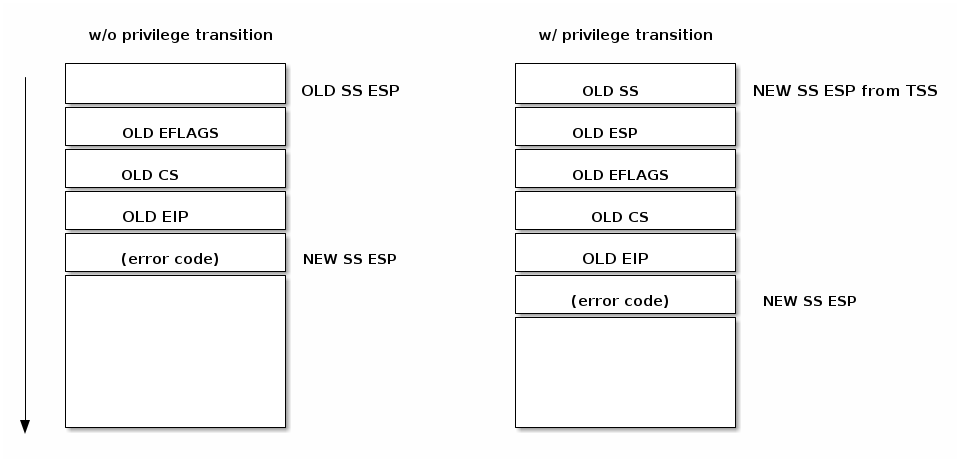

* [目次](/README.md#目次index)
* [システム・コール](/syscalls.rst.md#システムコール)

---

## 割り込み

### この講義の目的

   * いろいろな割り込みと例外（x86 の場合）

   * いろいろな割り込みと例外 (Linux の場合)

   * 遅延可能な作業

   * いろいろなタイマー

### 「割り込み」とは何か？

「割り込み」とはプログラムの通常の実行フローを変更する1個のイベントであり、いろいろなハードウェア・デバイスや CPU 自身によって生成されます。

割り込みは、その生成方法に基づいて二つのグループに分類することができます：

   * 同期方法

     - **同期型** （*synchronous*）： これは実行中の命令が生成する割り込み
     - **非同期型** （*asynchronous*）：これは外部のイベントが生成する割り込み

  * マスク可否

     - **マスク可能** （*maskable*）： これは無視することができる割り込みで、CPU の ``INT`` ピン経由で発行される
     - **マスク不可** （*non-maskable*）：これは無視できない割り込みで、CPU の ``NMI`` ピン経由で発行される

通常、「例外」と呼ばれる同期型の割り込みは、一個の命令を実行している過程でプロセッサ自身が検出したさまざまな状態を扱います。
例えば「０による除算」（*Divide by Zero*）やシステムコールは「例外」に該当します。

通常、「割り込み」と呼ばれる非同期型の割り込みはいろいろな I/O デバイスによって生成される外部イベントです。
例えばネットワーク・カードは割り込みを生成してパケットが到着したことを通知します。

#### いろいろな例外

例外の生成元は二つあります:

   * プロセッサの場合：

     - **fault**
     - **trap**
     - **abort**

   * プログラムの場合

     - **int N**

CPU が命令を実行中に異常状態（*Abnormal Condition*) を検出すると、プロセッサが検出したいろいろな例外が発生します。

例外の一種である「フォルト（**fault**）」は CPU が命令を実行する前に発生し、通常は修正が可能です。
保存された ``EIP`` にはフォルト発生の原因となった命令のアドレスが格納されているので、プログラムはこのフォルトを修正した後に問題のあった命令を再び実行することができます。
この例外は、例えばページ・フォルトなどがあります。

「トラップ（**trap**）」も例外の一種で、これは例外が検出された命令を実行した後に発生します。
保存された ``EIP`` にはトラップ発生の原因となった命令の次の命令のアドレスが格納されます。
この例外は、例えばデバッグのトラップがあります。

### ハードウェアの概念

#### 割り込みコントローラ（*Programmable Interrupt Controller*)

割り込みをサポートするデバイスは、割り込みの要求（*Interrupt ReQuest*）を発行する際に使用する出力ピンを持っています。
この「``IRQ`` ピン」は「割り込みコントローラ（``PIC``）」と呼ばれるデバイスに接続され、さらに PIC は CPU の ``INTR`` ピンに接続しています。

通常 PIC には CPU と情報を交換する際に使用する複数のポートがあります。
PIC が持つ IRQ 線の一つに接続している任意のデバイスが CPU から「注目」してもらいたい時、次の手順で処理が発生します：

   1. デバイスが該当する ``IRQ``*N* ピン上で割り込みを発生させる
   1. PIC が IRQ をベクタ番号に変換し、その番号を CPU が読み取れるようにするために PIC のポートに書き込む
   1. PIC が CPU の INTR ピン上で割り込みを発生させる
   1. PIC は CPU が割り込みを認識するまで待つ
   1. CPU が割り込みを処理する

CPU が割り込みを処理する方法はのちほど説明します。
重要な点は、設計上 PIC は CPU が現在の割り込みを認識するまで別の割り込みを発生させることはないと言うことです。

複数ある IRQ 線は個別に無効にすることができます。
これにより複数の割り込みハンドラが常に順番に実行されることを保証することができ、さらに設計が簡略化できます。

#### x86 専用割り込みコントローラ（*Advanced Programmable Interrupt Controller*)

複数の CPU コアを持つシステムでは、コア毎に一個の「ローカル ``APIC`` （*Local APIC*）」を持ち、タイマー割り込みや温度センサのようなコア専用で接続しているデバイスからの割り込みを処理します。

「I/O APIC」は外部のデバイスから CPU コアに IRQ を分配する際に使用します。

これらのハードウェアについて説明した後に、どのようにプロセッサが一個の割り込みを処理するのかを見てみることにしましょう。

#### 割り込みの制御

割り込みハンドラと、他の潜在的な並列処理（例えばドライバの初期化やドライバでのデータ処理）との間でデータを共有するためにアクセスを同期するには、制御された方法で割り込みを有効にしたり無効にする必要がでてきます。

これは複数のレベルで実現することが可能です：

   * デバイスのレベル

     * デバイスのコントロール・レジスタをプログラミングすることで実現する

   * PIC のレベル

     * PIC は指定した IRQ 線を無効にするようプログラミングが可能である

   * CPU のレベル

     * 例えば x86 系では次の命令を使用できる：

         * ``cli`` (_CLear Interrupt flag_ / 割り込みフラグをクリアする)

         * ``sti`` (_SeT Interrupt flag_ / 割り込みフラグをセットする)

### アーキテクチャ専用の割り込み処理（Linuxの場合）

このセクションでは、Linux で x86 系アーキテクチャ向けの割り込みを処理する方法について説明します。

#### 割り込みディスクリプタ・テーブル（*Interrupt Descriptor Table*）

「割り込みディスクリプタ・テーブル（``IDT``）」は割り込みや例外の識別子と対応するイベントを処理する命令のディスクリプタを関連付けたものです。
ここでは割り込みや例外の識別子を「ベクタ番号」と呼び、イベントを処理する命令を「割り込み/例外ハンドラ」と呼ぶことにします。

``IDT`` には次のような特徴があります：

   * ``IDT`` は、特定のベクタが発行されたら CPU によって使用される「ジャンプ・テーブル」（ハンドラへのポインタまたは機械語のジャンプ命令を格納した配列）である
   * ``IDT`` は、 256 x 8 バイトのエントリを持つ配列である
   * ``IDT`` は、物理メモリのどこにでも常駐できる
   * プロセッサは ``IDTR`` を使って ``IDT`` を特定する

以下に Linux における ``IRQ`` ベクタのレイアウトを示します。
最初の32個のエントリは例外用に予約され、「ベクタ#128」がシステムコールのインタフェースとして使用される以外、残りは主にハードウェアの割り込みハンドラとして使用されます。

x86 系アーキテクチャでは一個の IDT エントリのサイズは 8 バイトで、「ゲート（*Gate*）」と呼ばれています。
ゲートには三つの種類があります：

  * 割り込みゲート

    このゲートは割り込みハンドラまたは例外ハンドラのアドレスを保持しており、これらのハンドラにジャンプすると（もし割り込みフラグがクリアされていれば）マスク可能な割り込みが無効になる

  * トラップ・ゲート

    このゲートは割り込みゲートに似ていますが、割り込みハンドラや例外ハンドラにジャンプしてもマスク可能な割り込みを無効にしない点が違う

  * タスク・ゲート

    Linux では使用しない

それでは IDT エントリの各項目を見てみることにしましょう：

   * セグメント・セレクタ

     割り込みハンドラが格納されているコード・セグメント（の開始アドレス）を見つけるために使用する ``GDT/LDT`` 内のインデックス

   * オフセット

     コード・セグメント内でのオフセット値

   * T

     ゲートの種類を表す

   * DPL

     セグメントの内容を利用する際に必要となる最小限の権限

#### 割り込みハンドラのアドレス

割り込みハンドラの命令が格納されているアドレス（``ISR`` アドレス / *Interrupt Service Routine Address* ）を見つけるには、まずその命令が格納されているコード・セグメントの開始アドレスを見つける必要があります。
そのためセグメント・セレクタを使って ``GDB/LDT`` 内で該当する情報を検索します。これは対応するセグメント・ディスクリプタを見つけることができる情報です。
これは「ベース」項目に保持されている開始アドレスが提供されます。
そしてベース・アドレスとオフセットを使って、割り込みハンドラの先頭にジャンプすることができます。

#### 割り込みハンドラのスタック

通常の関数を呼び出す場合と同様に、割り込みハンドラや例外ハンドラの呼び出しも割り込みを発生させた箇所（コード）へ戻るために必要な情報を保存しておくのにスタックを使用します。

次の図でもわかるように、割り込みが発生した命令（コード）のアドレスを保存する前に ``EFLAGS`` レジスタを Push しておきます。
特定の種類の例外もまたデバッグしやすくするために、その例外が発生した時の問題あるコードをスタックに Push しておきます。

#### 割り込み要求の処理

一個の割り込みが生成されると、プロセッサは次に示すイベント・シーケンスを実行します。このシーケンスは最終的にカーネルの割り込みハンドラを呼び出します：

   1. CPU は現在の特権レベルをチェックする
   1. <特権レベルを変更する必要がある場合>
      * 現在使用中のスタック（古いスタック）を、新しい特権に関連づけられた新しいスタックに変更する
      * 古いスタックの情報を新しいスタックに Push する

   1. ``EFLAGS``、``CS``、``EIP`` の情報をスタックに Push する
   1. <**abort** の場合> はエラー・コードをスタックに Push する
   1. カーネルの割り込みハンドラを呼び出す

#### 割り込みハンドラから戻る処理

ほとんどのアーキテクチャは、割り込みハンドラを実行したあとにスタックをクリアして（一時停止していた）実行を再開する特別な命令を提供しています。
x86 系では、割り込みハンドラから戻る際に ``IRET`` 命令を使用します。
``IRET`` は ``RET`` 命令と似ていますが、前者はスタックに保存しているフラグのために ``ESP`` を4バイト余分にカウントし、そのフラグを ``EFLAGS`` レジスタに Move する点が違います。

x86 系では、割り込みの処理のあとに実行を再開する際は次のシーケンスを実行します：

   1. <**abort** の場合> エラー・コードを Pop する
   1. ``IRET`` 命令を呼び出す
      * スタックからいろいろな値を Pop して、``CS``、``EIP``、``EFLAGS`` といったレジスタにリストアする
      * もし <特権レベルを変更していたら> 古いスタックと古い特権レベルにそれぞれ戻す

### Linux の汎用的な割り込み処理

Linux の割り込み処理には３つのフェーズがあります： ``critical`` と ``immediate`` と ``deferred``

カーネルは、一番最初のフェーズで割り込み番号を決定する汎用割り込みハンドラ、特殊な割り込みを処理する割り込みハンドラ、そして割り込みコントローラを実行します。
この時、どんなタイミングであっても ``critical`` な処理が実行されます（例えば ``ACK IRQ`` 〜 割り込みコントローラのレベルで割り込みの認識など）。
このフェーズではプロセッサ別の割り込みは無効になり、次のフェーズでも引き続き無効になります。

二番目のフェーズでは、この割り込みに関連づけられた全てのデバイス・ドライバのハンドラが実行されます[注1]。
このフェーズの最後で割り込みコントローラの「割り込みの最後（*end of interrupt*）」というメソッドが呼び出され、割り込みコントローラでこの割り込みを再びアサートできるようになります。
この時点でプロセッサ別の割り込みが有効になります。

  * [注1] 一個の割り込みを複数のデバイスに関連付けることは可能であり、そのような場合「割り込みが共有されている」と言います。
	この共有された割り込みを使用する場合、通常はその割り込みがデバイスの対象であるかどうかを判断するのはデバイス・ドライバ側の責任になるので注意して下さい。

そして割り込み処理の最後のフェーズでは、割り込みコンテキストで延期することが可能な処理がいくつか実行されます。
これらは、しばしば割り込みの「ボトム・ハーフ（*bottom half*）」と呼ばれています（これに対し「アッパー・ハーフ（*upper half*）」とは割り込みを無効にして実行される割り込み処理の一部です）。
この時点でプロセッサ別の割り込みが有効になります。

#### ネストした割り込みと例外

多くのアーキテクチャでは「割り込みのネスト」[訳注1]が許されています。

  * [訳注1] 任意の割り込みハンドラの中で別の割り込みを受け付ける処理のこと。これを実現するには CPU が割り込みを受けた時に、まず割り込みコントローラに割り込みを受け付けたことを知らせ、これによって割り込みコントローラはまた別の割り込みを発生させることができるようになる（但し、同じ種類の割り込みは不可）。

一部のアーキテクチャは、保留中の割り込みが現在の（指定可能な）レベルよりも優先度が高い場合にのみ割り込みのプリエンプト（実行の中断）が可能になる割り込みレベルを定義しています（例えば ARM の優先度マスクを参照のこと）。

可能な限りたくさんのアーキテクチャをサポートするため、Linux ではネストする割り込みに対しては、他よりも厳格な実装になっています：

   * 任意の例外（例えばページ・フォルトやシステム・コール）は割り込みをプリエンプトすることはできない（実行を中断して割り込むことはできない）。もしそのような状況が発生したらバグであるとみなす。
   
   * 任意の割り込みは任意の例外または他の割り込みをプリエンプトできる（実行を中断して割り込める）。但し、プリエンプトが許される割り込みはネストがレベル１のものだけ。

次の図はネストが可能な割り込みのシナリオを示しています：

#### 割り込みコンテキスト

任意の割り込みが処理されている間（CPU の制御が割り込みハンドラにジャンプしてから、割り込みハンドラから戻ってくる 〜 例えば ``IRET`` 命令が発行される 〜 までの間）、コードは「割り込みコンテキスト（*Interrupt Contest*）」の中で実行されると言います。
割り込みコンテキストの中で実行されるコードには次のような特徴があります：

   * 例外ではなく、IRQ の結果としてコードが実行される
   * 明確に定義されたプロセス・コンテキストは関連付けられていない
   * コンテキストの切り替え（コンテキスト・スイッチ）を発動することはできない (従って、スリープできない、スケジューラーも使用できない、ユーザ空間のメモリにもアクセスできない）

#### 処理の延期が可能なタスク

「処理を先延ばしできるタスク（*Deferrable Action*）」とは、後になってからコールバック関数を呼び出すことを意味します。
処理を先延ばしできるタスクが、任意の割り込みハンドラからスケジューリングされた場合は、割り込みハンドラの処理が完了した「後」にそれに関連するコールバック関数が呼び出されます。

処理を先延ばしできるタスクは大きく分けて二つに分類できます。
それは「割り込みコンテキスト」の中で実行されるタスクと「プロセス・コンテキスト」の中で実行されるタスクです。

割り込みコンテキストの中で実行されるタスクの目的は、（処理時間がシビアな）割り込みハンドラの中でたくさんの処理を行わないようにすることです。
例えば割り込みを無効にしたまま長時間処理をするとレイテンシが増加したり、他の割り込みが発行されないためにシステム全体のパフォーマンスが低下する（具体例としては、割り込みが飛ばないため に CPU がネットワーク・インタフェースのキューからパケットを Pop しなくなるとネットワークのパケットをロストし、さらにネットワーク・インタフェースのバッファが満杯になってしまいます）といった望ましくない影響が生じる可能性があります。

Linux では処理を先延ばしできるタスクが３種類あります：

   * ソフト割り込み（*Soft IRQ*）

     * 割り込みコンテキストの中で実行する
     * 静的に確保される
     * 同じハンドラが複数のコアの上で並列して実行される場合がある

   * タスクレット（*Tasklet*）

     * 割り込みコンテキストの中で実行する
     * 動的に確保される場合がある
     * 同じハンドラが複数個に分けられて実行される（*Serialized*）

   * ワークキュー （*Workqueues*）

     * プロセス・コンテキストの中で実行する

処理を先延ばしできるタスクには次の API があります：
インスタンスの**初期化**、タスクの**活性化**または**スケジューリング**、そしてコールバック関数の実行の **mask/無効** と **unmask/有効** です。
後者はコールバック関数と他のコンテキストの間で同期するために使用します。

#### ソフト割り込み（Soft IRQs）

「ソフト割り込み」は割り込みハンドラからの処理を時間をおいてからあとで実行する低レベルな仕組みを指す用語ですが、依然として割り込みコンテキストの中で事項されます。

 ソフト割り込みの API:

   * 初期化: ``open_softirq()`` 関数
   * 活性化: ``raise_softirq()`` 関数
   * mask: ``local_bh_disable()`` 関数と  ``local_bh_enable()`` 関数

 一度、活性化されるとコールバック関数の ``do_softirq()`` が次のいずれかのタイミングで実行されます：

   * 任意の割り込みハンドラの後
   * カーネル・スレッドの ``ksoftirqd`` から任意のタイミング

いろいろなソフト割り込みが自分自身を再スケジューリングする可能性、もしくはそれらを再スケジューリングする他の割り込みが発生する可能性があるため、もしチェックが設定されていない場合は潜在的にソフト割り込みが（一時的な）プロセス枯渇につながる可能性があります。
さらに現在、Linux カーネルでは ``MAX_SOFTIRQ`` の値を越えてソフト割り込みを実行したり、``MAX_SOFTIRQ_RESTART`` の回数を越えて連続した再スケジューリングを行うことはできません。

これらの制限に到達してしまうと、特別なカーネル・スレッドである **ksoftirqd** が起床し、保留中の全てのソフト割り込みがこのカーネル・スレッドのコンテキストから実行されます。

ソフト割り込みの使用に関しては制限があり、低いレイテンシが必須ないくつかのサブシステムによって使用されます。
カーネル 4.19 の場合のソフト割り込みは次のとおりです：

    * HI_SOFTIRQ
    * TIMER_SOFTIRQ
    * NET_TX_SOFTIRQ
    * NET_RX_SOFTIRQ
    * BLOCK_SOFTIRQ
    * IRQ_POLL_SOFTIRQ
    * TASKLET_SOFTIRQ
    * SCHED_SOFTIRQ
    * HRTIMER_SOFTIRQ
    * RCU_SOFTIRQ

#### タスクレット（*Tasklets*）

   タスクレットは割り込みコンテキストの中で実行される先延ばしが可能なタスクの「動的」版（決まった数の上限はなし）です。

   タスクレットの API:

   * 初期化: ``tasklet_init()`` 関数
   * 活性化: ``tasklet_schedule()`` 関数
   * masking: ``tasklet_disable()`` 関数と ``tasklet_enable()`` 関数

   タスクレットは次の二つのソフト割り込みの先頭で実装されています：
   ``TASKLET_SOFITIRQ`` マクロと ``HI_SOFTIRQ`` マクロ

   さらにタスクレットは「シリアライズ化（*Serialize*）」されています。
   すなわち、同じタスクレットは１個のプロセッサだけで処理されます。

#### ワークキュー（*Workqueues*）

   ワークキューはプロセス・コンテキストの中で実行される先延ばしが可能なタスクです。

   これらはカーネル・スレッドの先頭で実装されています。

   ワークキューの API:

   * 初期化: ``INIT_WORK`` マクロ
   * 活性化: ``schedule_work()`` 関数

#### タイマー（*Timers*）

   タイマーは ``TIMER_SOFTIRQ`` マクロの先頭で実装されています。

   タイマーの API:

   * 初期化: ``setup_timer()`` 関数
   * 活性化: ``func:`mod_timer()`` 関数

---

* [目次](/README.md#目次index)

* [対称型マルチプロセッシング](/smp.rst.md#対称型マルチプロセッシング)

