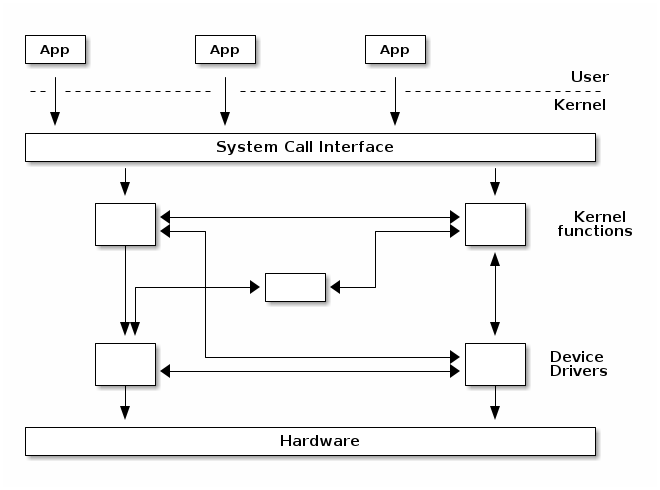
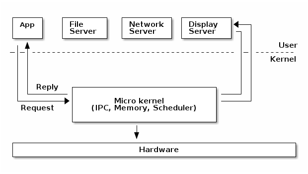
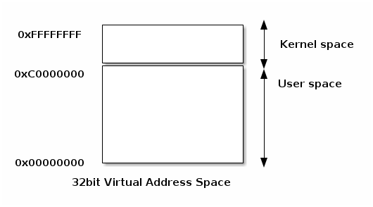
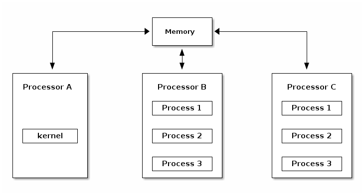
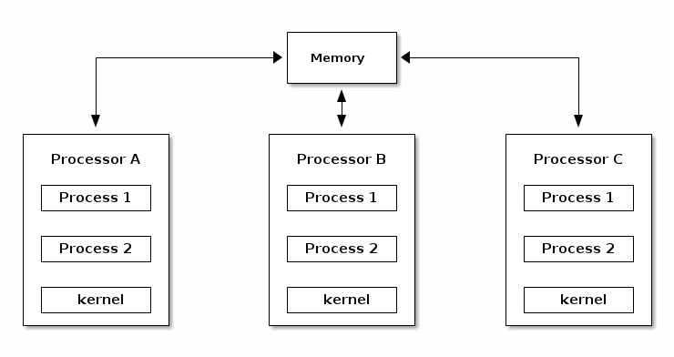
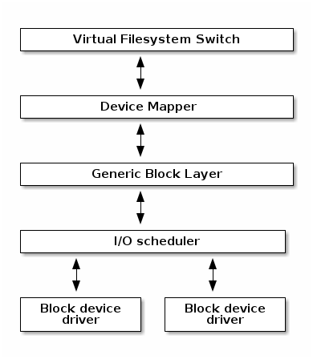
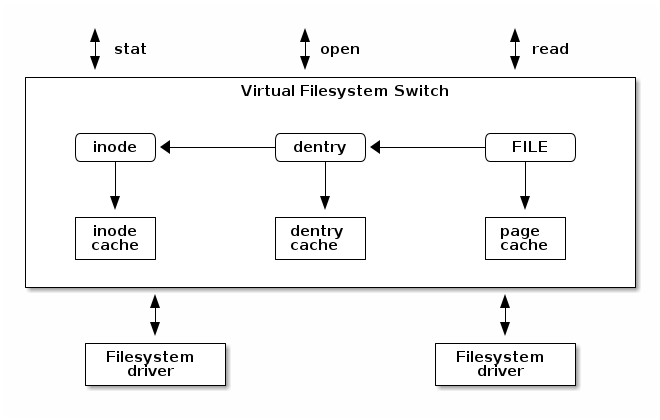

## はじめに

*これは [The Linux Kernel](https://linux-kernel-labs.github.io/refs/heads/master/index.html) の LECTURES にある [Introduction](https://linux-kernel-labs.github.io/refs/heads/master/lectures/intro.html#introduction) の日本語訳である*

### この講義の目的

   * オペレーティング・システムの基本的な用語とその概念

   * Linux カーネルの概要

### オペレーティング・システムの基本的な用語と概念

#### 「ユーザ」 vs 「カーネル」

「カーネル」と「ユーザ」はオペレーティング・システムの概念の中でよく出てくる用語です。
これらの意味はとても簡単です：
カーネルはユーザよりも高い権限で実行するオペレーティング・システムの一部であり、それに対しユーザは通常、低い権限で実行されるアプリケーションを意味しています。

しかし、これらの用語はちょっと大げさな表現であり、ある状況ではかなり特殊な意味を持つ場合があります。

「ユーザ・モード」と「カーネル・モード」は CPU プロセッサの実行モードを指す用語です。
カーネル・モードで実行するコードは完全に[^hypervisor] CPU を制御できますが、ユーザ・モードで実行されるコードは幾つか制限があります。
例えば CPU の割り込みはカーネル・モードで実行中の間にのみ無効にしたり有効にすることができます。
もし、そのような処理がユーザ・モードで行われたら例外が発生し、カーネルがその例外を引き継ぎます。

[^hypervisor]:プロセッサの中にはカーネル・モードよりも更に高い特権を持つものがあります。
例えば「ハイパーバイザ・モード」はハイパーバイザ（仮想マシンを監視するシステム）で実行しているコードにだけアクセスが可能です。

「ユーザ空間」と「カーネル空間」という用語は特にメモリ保護、またはカーネルまたはユーザのアプリケーションのいずれかに関連づけられている仮想アドレス空間を指す場合があります。

説明をかなり単純化すると、カーネル空間はカーネルのために予約されているメモリ領域であり、それに対してユーザ空間は特定のユーザ・プロセスのために予約されたメモリ領域です。
カーネル空間へのアクセスは保護されているので、ユーザのアプリケーションから直接アクセスすることはできませんが、ユーザ空間にはカーネル・モードで実行しているコードから直接アクセスすることができます。

#### 一般的なオペレーティング・システムの基本概念

一般的なオペレーティング・システムのアーキテクチャ（下図を参照のこと）において、カーネルの仕事は複数のアプリケーションの間でハードウェアへのアクセスやリソースの共有を安全かつ公平に行えるようにすることです。

カーネルは、一般に「システム・コール」と呼ばれるアプリケーションが発行する API 一式を提供します。
これらの API は、その実行モードがユーザ・モードからカーネル・モードに切り替わる境界線にあたるため、通常のライブラリが提供する API とは異なります。

アプリケーションに互換性を提供するため、システム・コールが変更されることはめったにありません。
Linux の場合は、特にこのルールに厳格です（必要に応じて変更が可能なカーネル API とは対照的です）。

カーネルのコードそのものは、論理的にカーネルのコア部とデバイス・ドライバにそれぞれ分離が可能です。
デバイス・ドライバのコードは特定のデバイスへのアクセスを担当し、カーネルのコア部のコードは汎用的なコードです。
カーネルのコア部はさらに論理的なサブシステム（例えばファイルへのアクセス、ネットワーク、プロセス管理など）に分離できます。

#### モノリシック・カーネル（*Monolithic kernel*）

「モノリシック・カーネル」ではカーネル内のサブシステム同士のアクセスは保護されておらず、またいろいろなサブシステム同士でグローバル関数を直接呼び出すことができるカーネルです。

但し、ほとんどのモノリシック・カーネルはサブシステム間で論理的な独立を強制します。特にカーネルのコア部とデバイスドライバの間は比較的に厳格な API を使用します（但し、必ずしもそれで固定されているという訳ではない）。この API は一つのサブシステムまたは複数のデバイス・ドライバによって提供されるサービスにアクセスする際に使用します。
もちろん、これはカーネルの実装とそのアーキテクチャによって異なります。

#### マイクロ・カーネル（*Micro kernel*）

「マイクロ・カーネル」は、カーネルの大部分がお互いに保護され、通常はユーザ空間で複数のサービスを実行しているカーネルです。
そこでは、いくつかあるカーネルの重要な部分がユーザ・モードで実行されているため、カーネル・モードで実行される残りのコードは非常に小さいと言うことがマイクロ・カーネルと言う名前の由来となります。

マイクロ・カーネルのアーキテクチャにおいて、カーネルは実行中のいろいろなプロセスの間でメッセージをやり取りを可能にする十分なコードが含まれます。
実際には、カーネルの中にスケジューラと IPC のメカニズムが実装されている他、アプリケーションとカーネルのサービスとの間の保護機能を設定するための基本的なメモリ管理が実装されています。

このアーキテクチャの利点の一つは、カーネルのサービスが独立しているため、一つのサービスのバグが他のサービスに影響を与ることはないと言うことです。

したがって、もし何かサービスがクラッシュしてもシステム全体に影響を与えることなく、そのサービスを再起動することができます。
しかしながらサービスの再起動はそれに依存する全てのアプリケーションに影響を与える可能性があるので（例えばファイル・サーバがクラッシュしたら、ファイル・ディスクプリタ経由でオープンしていたファイルにアクセスした全てのアプリケーションでエラーが発生します）、実際にこれを実現するのは困難です。

このアーキテクチャのカーネルにはモジュール型のアプローチが必要で、サービス間のメモリ保護機能を提供しますが、パフォーマンスが犠牲になります。
反対に、モノリシック・カーネルでは二つのサービスの間の簡単な関数呼び出しでも IPC とスケジューラを使う必要があるのでパフォーマンスが低下します[^minix-vs-linux]。

[^minix-vs-linux]:https://lwn.net/Articles/220255/

#### マイクロ・カーネル vs モノリシック・カーネル

よくマイクロ・カーネルの擁護者は、モジュール型の設計手法を採用しているマイクロ・カーネルの方が優れていると主張します。
しかし、モノリシック・カーネルもモジュール化に対応することが可能で、これに関しては最新のモノリシック・カーネルを使用すると言う解決方法がいくつかあります：

   * モジュール化するコンポーネントはコンパイル時に有効または無効にできる

   * 実行中にロード可能なカーネル・モジュールをサポートする

   * カーネルを論理的で独立したサブシステムとして扱う

   * インタフェースは厳密であるが、パフォーマンスのオーバーヘッドが少ないマクロやインライン関数、そして関数のポインタを使う

かってモノリシック・カーネルとマイクロ・カーネル（例えば Windows や Mac OS X）の間にハイブリッド・カーネルなるオペレーティング・システムの種類がありました。
しかし、これらのオペレーティング・システムでは典型的なモノリシック・サービスが全てカーネル・モードで動くので、モノリシック・カーネル以外にそれらのサービスを動かせるようにするメリットは殆どありません。

多くのオペレーティング・システムとカーネルの専門家たちは、このレッテルには意味はなく、ただの商用向けの売り文句だとしてはねつけています。
この件について Linus Torvalds 氏は次のように語っています：

> 「ハイブリッド・カーネル」そのものは - ただのマーケティング用語です。
> 「そうそう、マイクロ・カーネルには優れた『広告塔』がありました。我々が作業しているカーネルでも優れた広告塔を持つにはどうすればよいだろう？ ああ、こんなのはどうだろうか。かっこいい名前を付けて、他のシステムが持つ広告塔よりも全て優れてますよと言うことを間接的に伝えてみるというのは。」といった感じです。

#### アドレス空間

   * 物理アドレス空間

     * RAM と周辺機器のメモリ

   * 仮想アドレス空間

     * CPU がメモリを認識する方法 (プロテクト・モード / ページング・モード の時)

     * プロセスのアドレス空間

     * カーネルのアドレス空間

「アドレス空間」は、さまざまな文脈で異なる意味を持つ多重定義が可能な用語です。

「物理アドレス空間」はメモリ・バス上にある RAM とデバイスのメモリの見え方を反映しています。
例えば、32ビットの Intel アーキテクチャの場合、一般的に物理メモリの低位の空間に RAM がマップされるのに対し、グラフィクス・カードのメモリは物理メモリの高位の空間にマップされます。

「仮想メモリ空間」（または単に「アドレス空間」）は仮想メモリ・モジュールが動きだした時（「プロテクト・モードが有効になった」時、または「ページングが有効になった」時）に CPU から見たメモリの見え方を反映したものになっています。
カーネルは、仮想メモリ空間の中から任意のメモリ領域を確保して、特定の物理メモリ領域に投影する「マッピング」を担当しています。

仮想アドレス空間に関連して、よく使用する別の用語が二つあります： それはプロセス（アドレス）空間とカーネル（アドレス）空間です。

「プロセス空間」は任意のプロセスに関連づけられた仮想アドレス空間（の一部）です。
プロセスの「メモリ表示」です。
0から始まる連続した領域です。
プロセスのアドレス空間がどこで終わるかは実装とアーキテクチャによって異なります。

「カーネル空間」はカーネル・モードで動作するコードの「メモリ表示」です。

#### ユーザとカーネルが共有する仮想アドレス空間

ユーザ空間とカーネル空間で特徴ある実装は、仮想アドレス空間をユーザ空間のプロセスとカーネルとの間で共有する部分です。

この場合、カーネル空間はアドレス空間の一番上に位置し、反対にユーザ空間は一番に下に置かれます。
ユーザ空間のプロセスがカーネル空間にアクセスできないようにするために、カーネルがユーザ・モードからカーネル・モードにアクセスできないようなマッピングを生成します。

#### いろいろな実行コンテキスト（*Execution contexts*）

   * プロセスのコンテキスト

     * ユーザ・モードで実行するコード（プロセスの一部）

     * プロセスが発行したシステム・コールの結果として、カーネル・モードで実行するコード

   * 割り込みのコンテキスト

     * 割り込みの結果として実行するコード

     * 常にカーネル・モードで実行する

カーネルの最も重要な仕事の一つがいろいろな「割り込み」の提供で、効率よく「割り込み」を提供するというものです。
これは特別に実行する専用のコンテキストが関連づけられているほど、とても重要です。

割り込みが発生した結果としてカーネルが何かを実行する際は「割り込みのコンテキスト」の中で実行されます。
これには割り込みハンドラが含まれていますが、これに限定されることはなく、他にも割り込みモードで実行される特別なソフトウェアの概念があります。
割り込みのコンテキストの中で実行されるコードは常にカーネル・モードで処理されますが、カーネル・ハッカーが注意しなければならないお決まりの制限がいくつかあります（例えば処理をブロックするような関数を呼び出さないこと、またはユーザ空間にアクセスしないこと）。

割り込みのコンテキストに対して、プロセスのコンテキストというものがあります。
プロセスのコンテキストの中で実行されるコードはユーザ・モード（アプリケーションの実行）またはカーネル・モード（システム・コールの実行）で処理されます。

#### マルチ・タスク

   * 複数のプロセスの「同時」実行をサポートした OS

   * 実行中のプロセスの間を高速に切り替える実装が、ユーザと各種プログラムとの対話を可能にしている

   * 実装:

     * 協調（*cooperative*）

     * プリエンプティブ（*preemptive*）

「マルチタスク」とはオペレーティング・システムが複数のプログラムを「同時に」実行する能力です。
これは、実行中のプロセスを素早く切り替えることで実現しています。

「協調的なマルチタスク」にはマルチタスクを達成するために協力するプログラムが必要になります。
任意のプログラムが実行中に、自発的に CPU 制御を OS に戻すことで、別のプログラムに CPU 制御が割り当てられます。

「プリエンプティブ・マルチタスク」の能力を持つカーネルは各プロセスに厳格な制限を課すことで、全てのプロセスは公平に実行する機会が与えられます。
各プロセスは任意のタイムスライスの期間（例えば 100ms）は実行できるが、その後も実行中だと、強制的にプリエンプト（実行が中断）されて、他のタスクに CPU 制御が渡されるようにスケジューラが動きます。

#### プリエンプティブ・カーネル

「プリエンプティブ・マルチタスク」と「プリエンプティブ・カーネル」は別の用語です。

カーネル・モードで実行している最中に任意のプロセスがプリエンプトされたら、そのカーネルはプリエンプティブ・カーネルです。

但し、プリエンプティブではないカーネルでもプリエンプティブ・マルチタスクをサポートしている可能性があるので注意して下さい。

#### ページングが可能なカーネルのメモリ

カーネルが使用するメモリの一部（コードやデータ、スタックまたは動的に確保するヒープ）をディスクにスワップすることが可能な場合、そのカーネルはページング可能なカーネル・メモリをサポートしていると言います。

#### カーネルのスタック

プロセスはそれぞれ、システム・コールの結果としてカーネル・モードで処理している間、関数を呼び出した順番やローカル変数の状態を記憶しておくための「カーネル・スタック」を持っています。

このカーネル・スタックのサイズは小さい（4KB〜12KB）ので、カーネル開発者はスタックに巨大な構造体を確保したり、無限の再帰呼び出しをしないように注意する必要があります。

#### 移植性 (*Portability*)

いろいろなアーキテクチャやハードウェア構成に対する移植性を高めるために、最新のカーネルのトップレベルは次のような構成になっています：

   * アーキテクチャとマシン専用のコード（Ｃ言語とアセンブラ）

   * アーキテクチャに依存しないコード（Ｃ言語）：

     * カーネルのコア部（さらに複数のサブシステムに分割される）

     * デバイス・ドライバ

このような対応により、アーキテクチャやマシン構成が異なる場合でも可能な範囲でコードの再利用が容易になります。

#### 非対称型マルチプロセッシング（*Asymmetric MultiProcessing*）

「非対称型マルチプロセッシング（ASMP）」はカーネルが複数のプロセッサ（コア）をサポートする方式の一つで、一個のプロセッサはカーネルの処理に専念し、他の全てのプロセッサはユーザ空間のプログラムを実行します。

この方式の欠点は、カーネルのスループット（例えばシステム・コールや割り込み処理など）がプロセッサ数に比例しないしないことであり、そのために特定のプロセッサが頻繁にシステム・コールを処理することになります。
この方式の利用はかなり特殊なシステム（例えば科学計算のアプリケーションなど）に限定されます。

#### 対照型マルチプロセッシング（*Symmetric MultiProcessing*）

ASMP とは対照的に、SMP モードのカーネルはマシンに搭載されているどのプロセッサでもユーザのプロセスを実行できます。
この方式の実装はかなり難しく、その理由は、例えば二個のプロセッサがメモリの同じ場所にアクセスする関数を実行していた場合、カーネル内部で競合状態が発生するからです。

SMP をサポートするためにカーネルは「同期プリミティブ（例えばスピン・ロックなど）」を実装し、重大なクリティカル・セクションを実行できるプロセッサは１個だけであることを保証する必要があります。

#### CPU のスケーラビリティ

「CPU のスケーラビリティ」とは、CPU に搭載されたコア数に応じてどれだけ CPU 全体のパフォーマンスが向上するかを表します。
これに関してカーネル開発者が留意しておくべきことがいくつかあります：

   * 可能ならば Lock-free なアルゴリズム[^lock-free-algorithm]を使う

   * 高い確率で競合が起こるクリティカル・セクションでは粒度の高いロックを使用する

   * アルゴリズムの複雑さに注意する

[^lock-free-algorithm]:複数のスレッドが同時並行的に、対象となるデータを破壊することなく読み書きすることを可能にするアルゴリズムのこと。

### Linux カーネルの概要

#### Linux の開発モデル

   * オープンソース、GPLv2 ライセンス

   * 貢献者：企業、学生、個人（独立系の開発者）

   * 開発サイクル：3 〜 4 ヶ月（バグ修正に続いて 1 〜 2 週間のマージ・ウィンドウ[^merge-window] を含む）

[^merge-window]:リリース版を出したら、次のバージョンのリリース候補（RC）版が作成される二週間程度の間に重要な変更をマージして、その後のリリース候補を安定化のために利用すると言う仕組み。

   * 新機能はマージ・ウィンドウで許可されたものだけ

   * マージ・ウィンドウ後のリリース候補（RC）版は週単位でリリースされる（-rc1、-rc2 など)

Linux カーネル開発は世界最大のオープンソース・プロジェクトの一つであり、何千人もの開発者がコードを提供し、リリースするごとに何百万行ものコードが変更されています。

Linux カーネルは GPLv2 ライセンスで配布されています。
簡単に言うと、顧客に出荷されるソフトウェアで行われたカーネルの変更はすべて顧客でも利用できるようにする必要があり、実際に企業のほとんどが（自らが変更した）ソースコードを公開しています。

Linux カーネル開発にコードを提供しているのは大学生や個人（独立系の開発者）の他にも、たくさんの企業（その多くは競合他社同士）が存在します。

現在の開発モデルは、基本的に一定の期間（通常は 3 〜 4 ヶ月）でリリースしていくというものです。
新しい機能は 1 〜 2 週間に渡って実施されるマージ・ウィンドウ中にカーネルにマージされます。
マージ・ウィンドウが終わると、リリース候補が週単位でリリースされます（-rc1、-rc2 など）。

#### メンテナーの階層

開発プロセスを見積もるために、Linux は階層型のメンテナス・モデルを採用しています：

   * Linus Torvalds 氏は Linux カーネルのメンテナであり、サブシステムのメンテナからの Pull リクエスト[^pull-request] をマージする

[^pull-request]:コードの変更をメンテナに通知しマージを依頼する仕組み。

   * 各サブシステムには一人以上のメンテナがおり、開発者やデバイス・ドライバのメンテナから提供されたパッチや Pull リクエストを受け付ける

   * メンテナはそれぞれ自分の git ツリーを持っており、代表的なものとしては：

     * Linux Torvalds 氏 : [git://git.kernel.org/pub/scm/linux/kernel/git/torvalds/linux-2.6.git](git://git.kernel.org/pub/scm/linux/kernel/git/torvalds/linux-2.6.git)

     * David Miller 氏（ネットワーク担当）: [git://git.kernel.org/pub/scm/linux/kernel/git/davem/net.git/](git://git.kernel.org/pub/scm/linux/kernel/git/davem/net.git/)

   * 各サブシステムは ``-next`` ツリーを管理し、開発者が次のマージ・ウィンドウのパッチを提出できるようにする

マージ・ウィンドウは最大で2週間しかないので、ほとんどのメンテナは ``-next`` ツリーを立ち上げ、マージ・ウィンドウが終了した後も開発者や下流のメンテナから提出された新しい機能の Pull リクエストを受け付けています。

バグの修正については、マージ・ウィンドウが終わった後でもメンテナのツリーで受け付けていることに注意して下さい。これらのパッチはリリース候補が作成される度に、定期的に上流のメンテナに Pull される仕組みです。

#### Linux のソース・コードの配置

これらは Linux のソース・コードのトップレベルにあるディレクトリの一覧です：

* ``arch`` - このフォルダにはアーキテクチャ特有のコードが含まれる ; 各アーキテクチャはそれぞれ専用のサブ・フォルダ（例えば ``arm``、``arm64``、``x86`` など）の下で実装されている

* ``block`` - このフォルダにはいろいろなブロック・デバイスからデータの読み書きを処理するブロック・サブシステムのコードが含まれる: 具体的には、ブロック I/O 要求の作成、I/O 要求のスケジューリング（いくつかの I/O スケジューリングが利用できる）、I/O 要求のマージ、そして I/O 要求を I/O スタックを介してブロック・デバイスのドライバに渡す

* ``certs`` - フォルダは証明書を使って署名を確認するための仕組みが実装されている

* ``crypto`` - このフォルダには、いろいろな種類の暗号化アルゴリズムの実装と、その類の暗号化アルゴリズムをハードウェアで解除することができるフレームワークが含まれる

* ``Documentation`` - このフォルダには、いろいろなサブシステム、Linux カーネルのコマンド・ライン・オプション、``sysfs`` 配下のファイルとフォーマットの説明、そしてデバイス・ツリーのバインディング（サポートしているデバイス・ツリーのノードとフォーマット）などのドキュメントが含まれる

* ``drivers`` - このフォルダには、いろいろな種類のデバイス・ドライバの他に、Linux のドライバ・モデルの実装（ドライバ自体、デバイス・バス、そして接続方法について記述した抽象化モデル）が含まれる

* ``firmware`` - このフォルダには、いろいろな種類のデバイス・ドライバから利用される 2進または16進のファームウェアのファイルが含まれる

* ``fs`` - このフォルダには Linux の仮想ファイルシステム・スイッチ（ファイルシステムの汎用コード）といろいろな種類のファイルシステムのドライバが含まれる

* ``include`` - このフォルダにはヘッダ・ファイルが含まれる

* ``init`` - このフォルダには Kernel 起動時に実行される、アーキテクチャに特化しない汎用的な初期化コードが含まれる

* ``ipc`` - このフォルダには、メッセージ・キュー、セマフォ・共有メモリといったいろいろなプロセス間通信のシステムコールの実装が含まれる

* ``kernel`` - このフォルダには、プロセス管理（カーネル・スレッド、ワークキューのサポートを含む）やスケジューラ、トレース、時刻管理、汎用 IRQ、そしてロックなどのコードが含まれる

* ``lib`` - このフォルダには、ソートやチェックサム、文字列の比較、圧縮と解凍、ビットマップの操作などといった汎用的なユーテリティ関数の実装が含まれる

* ``mm`` - このフォルダには、物理メモリと仮想メモリの両方の（ページのメカニズムを含む）メモリ管理用のコードや ``SL*B`` と ``CMA`` アロケータ、スワップ、仮想メモリのマッピング、プロセスのアドレス空間操作などの実装が含まれる

* ``net`` - このフォルダには、IPv4 と IPv6 を含むいろいろなネットワーク・スタックにある実装が含まれる; その他に BSD ソケットの実装、経路、フィルタリング、パケットのスケジューリング、ブリッジなどの実装が含まれる

* ``samples`` - このフォルダには、いろいろなドライバのサンプル・コードが含まれる

* ``scripts`` - このフォルダはビルド・システムの一部で、モジュールのビルドで使うスクリプトや Linux カーネルの設定で使う ``kconfig`` の他にもいろいろなスクリプト（例えば ``checkpatch.pl`` はパッチ・ファイルが Linux カーネルのコーディング規則に準拠しているかどうかをチェックする）が含まれる

* ``security`` - このフォルダには、デフォルトの Unix セキュリティ・モジュールで拡張することが可能な Linux セキュリティ・モジュールのフレームワークの実装の他に、SELinux や smack、apparmor、tomoyo といった複数の拡張キットの実装が含まれる

* ``sound`` - このフォルダには、``ALSA``（*Advanced Linux Sound System*）の他に旧型の Linux サウンド・フレームワーク (``OSS``) の実装が含まれる

* ``tools`` - このフォルダには、いろいろな Linux カーネル・サブシステムを使ったテストや対話する際に使うユーザ空間のツールがいろいろ含まれる

* ``usr`` - このフォルダには ``initrd`` ファイルをカーネルの中に埋め込むための実装が含まれる

* ``virt`` - このフォルダには ``KVM``（*Kernel Virtual Machine*）のハイパーバイザの実装が含まれる

#### Linux カーネルのアーキテクチャ

##### arch

   * アーキテクチャ特有のコード

   * マシン特有のコードの中でさらにディレクトリが細分化されている可能性あり

   * ブート・ローダーとのインタフェースとアーキテクチャ特有の初期化

   * 割り込みコントローラや SMP コントローラ、そしていろいろな BUS コントローラと例外や割り込みの設定、仮想メモリの扱い等、アーキテクチャまたはマシン特有の様々なハードウェアの仕掛けにアクセスする

   * アーキテクチャ向けに最適化したいろいろな関数（例えば ``memcpy()`` や文字列操作など）

この部分にはアーキテクチャ特有のコードが含まれており、場合によっては、arm などの特定のアーキテクチャに対するマシン特有のコードにさらに分割されます。

「Linux は初め 32-ビットの x86 ベースな PC（386 以上）向けに開発されました。
最近では、（少なくとも）Compaq Alppha AXP、Sun SPARC と UltraSPARC、Motorola 68000、PowerPC、PowerPC6、ARM、Hitachi SuperH、IBM S/390、MIPS、HP PA-RISC、Intel IA-64、DEC VAX、AMD x86-64、そして CRIS アーキテクチャ上で動きます。」

例えば、割り込みコントローラや SMP コントローラ、そして様々な BUS コントローラや例外、割り込みの設定、仮想メモリの扱い等、アーキテクチャやマシン特有のいろいろなハードウェアの仕掛けにアクセスする実装になっています。

さらにアーキテクチャ向けに最適化された（例えば ``memcpy()`` や文字列操作などの）いろいろな関数を実装しています。

##### いろいろなデバイス・ドライバ

   * 統一されたデバイス・モデル

   * 各サブシステムは独自のドライバー・インタフェースを持つ

   * たくさんのデバイス・ドライバの種類がある（TTY、シリアル、SCSI、ファイルシステム、イーサーネット、USB、フレームバッファ、入力デバイス、サウンドなど）

Linux カーネルは、システムの状態とその構造を反映したデータ構造体を内部で維持することを目的として、統一されたデバイス・モデルを採用しています。
このようなデータ構造体には、例えば現在接続されているデバイスは何か？ それらの状態は？ あるいは、どのバスに何のデバイスが接続されているか？ などといった情報が含まれています。
これはシステム規模の電源管理やデバイスの検出、そして動的なデバイスの挿抜の実装には不可欠な情報です。

各サブシステムには、もっと簡単に妥当なドライバを記述できたり、同じようなコードが重複しないよう実装を簡単に共通化できるようにするために、いろいろなデバイスとの間の調整役となる独自のドライバ・インタフェースがあります。

Linux は種類が異なるデバイス・ドライバをたくさんサポートしています。
その幾つかは、例えば TTY、シリアル、SCSI、ファイルシステム、イーサーネット、USB、フレームバッファ、入力デバイス、サウンドなどがあります。

##### プロセス管理

   * Unix の基本的なプロセス管理と POSIX のスレッドをサポートする

   * プロセスとスレッドはタスクを抽象化したもの

   * オペレーティング・システム規模の仮想化

     * いろいろな名前空間

     * たくさんのコントロール・グループ

Linux は、``fork()`` や ``exec()`` や ``wait()`` といった標準的な Unix におけるプロセス管理の API を実装している他に、こちらも標準的な POSIX スレッドを実装しています。

但し、Linux のプロセスとスレッドは他のカーネルとはかなり異なる方法で実装されています。
カーネル内部でプロセスやスレッドそのものを実装した構造ではなく、代わりに「タスク」と呼ばれるスケジューリングの単位を表す ``struct task_struct`` が存在します。

タスクは、アドレス空間、ファイル・ディスクリプタ、IPC の ids などの「リソース」を指すポインタを持っています。
同じプロセスの一部であるタスクのリソース・ポインタは同じリソースを指し、別のプロセスのタスクのリソース・ポインタは別のリソースを指しています。

これは特に、``clone()`` と ``unshare()`` といったシステム・コールを一緒に使うことでて「名前空間」のような新しい機能を実装することができます。

名前空間は「コントロール・グループ」（``cgroup``）と一緒に使用して、Linux でいろいろなオペレーティング・システムの仮想化を実装します。

``cgroup`` はプロセスを階層化してまとめ、コントロールし変更が可能なルールの中で階層に従ってシステムのリソースを分散させる仕組みです。

##### メモリ管理

Linux のメモリ管理は、次のような仕組みを扱うため複雑なサブシステムになっています：

   * 物理メモリの管理： メモリの確保と解放

   * 仮想メモリの管理： ページング（*paging*）、スワップ操作（*swapping*）、デマンド・ページング（*demand paging*）、コピー・オン・ライト（*copy on write*）

   * ユーザ空間のサービス： ユーザのアドレス空間の管理（例えば ``mmap()``、``brk()`` そして共有メモリなど）

   * カーネル空間のサービス： ``SL*B`` 系アロケータ、``vmalloc()``

##### ブロック I/O の管理

Linux のブロック I/O サブシステムはブロック・デバイスからデータの読み込み、またはブロック・デバイスへデータの書き込みを処理します：
具体的にはブロック I/O 要求の作成、ブロック I/O 要求の変換（例えば、ソフトウェア RAID や LVM の場合)、I/O 要求の合体と並び替え、そしていろいろな I/O スケジューラを介して I/O 要求をブロック・デバイスのドライバにスケジューリングしながら送信する

##### 仮想ファイルシステム・スイッチ

Linux 仮想ファイルシステム・スイッチ（``VFS``）は、いろいろなファイルシステムのドライバで重複したコードを減らすためにファイルシステムのコードを共通化または汎用化して実装しています。
これにより、次に示すようなファイルシステムの抽象化が導入されます：

* ``inode`` - ディスクの上のファイルを表す（ファイルの属性やディスク上のデータ・ブロック領域における位置）

* ``dentry`` - ``inode`` に「名前」を関連付ける

* ``file`` - オープンしたファイルのプロパティを表す（例えば、ファイル・ポインタ）

* ``superblock`` - フォーマットしたファイルシステムのプロパティを表す（例えば、ブロック数、ブロック・サイズ、ディスク上の root ディレクトリの位置、暗号化、など）

さらに Linux の VFS は、次に示すような複雑なキャッシュのメカニズムを実装しています：

* inode キャッシュ - ファイルの属性値と内部のメタデータをキャシュする

* dentry キャッシュ - ファイルシステムのディレクトリ階層をキャシュする

* page キャッシュ - ファイルのデータ・ブロックをメモリの中にキャシュする

##### ネットワーク・スタック

#### Linux のセキュリティ・モジュール

   * Linux のデフォルトのセキュリティ・モデルを拡張してフックする

   * 次に示す Linux セキュリテイ拡張によって使用される：

     * [SELInux（*Security Enhancened Linux*）](https://www.nsa.gov/what-we-do/research/selinux/)

     * [AppArmor](https://gitlab.com/apparmor)

     * [Tomoyo](http://tomoyo.osdn.jp)

     * Smack

---

* [目次](/README.md#目次index)

