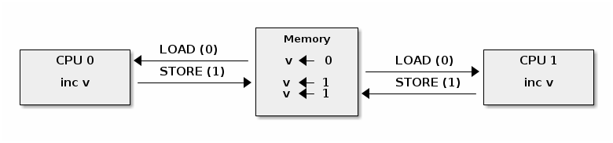
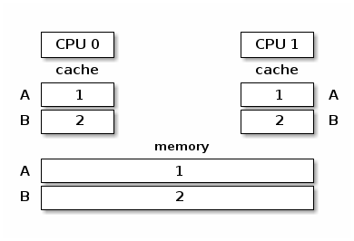
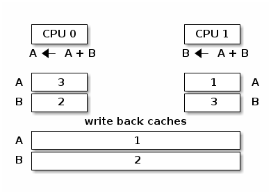
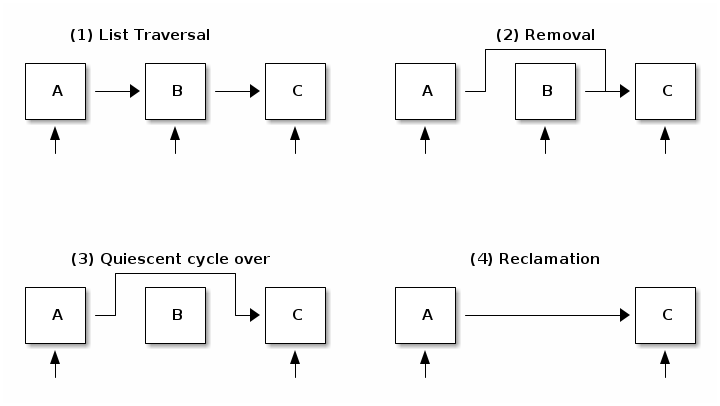

* [目次](/README.md#目次index)
* [割り込み](/interrupts.rst.md#割り込み)

---

## 対称型マルチプロセッシング

### この講義の目的

   * [カーネルの並列処理](/smp.rst.md#linux-カーネルのいろいろな並列処理linux-kernel-concurrency-sources)

   * [アトミックな操作](/smp.rst.md#アトミックな操作atomic-operations)

   * [スピン・ロック](/smp.rst.md#スピンロック)

   * キャッシュのスラッシング（*thrashing*）

   * [最適化したスピン・ロック](/smp.rst.md#スピンロックの最適化)

   * [プロセスと割り込みのコンテキストの同期](/smp.rst.md#プロセスと割り込みのコンテキストの同期)

   * [ミューテックス（*Mutexes*）](/smp.rst.md#ミューテックスmutexes)

   * [CPU ごとのデータ](/smp.rst.md#cpu-ごとのデータ)

   * [メモリ・オーダリング（*Ordering*）とメモリ・バリア（*Barrier*）](/smp.rst.md#メモリオーダリングorderingとメモリバリアbarrier)

   * [リード・コピー・アップデート（*Read-Copy Update*）](/smp.rst.md#リードコピーアップデートrcu)


### 同期の基本

Linux カーネルが「対称型マルチプロセッシング（**SMP**）」をサポートしているので、一連の同期メカニズムを使用して競合状態のない期待したとおりの結果を出してあげる必要があります。


---

##### Note

この講義では「コア（*Core*）」と「CPU」 と「プロセッサ」という用語を同じ意味で使用しています。

---


次に示す二つの状態が同時に発生すると競合状態になる可能性があります：

 1. 「並列」実行される実行コンテキストが最低二つ存在する状態:

    * 完全に並列実行する（例: 二つのシステム・コールが別々のプロセッサで処理される）

    * 複数ある実行コンテキストの一つが他の実行コンテキストを任意にプリエンプトする（CPU の実行権を奪う）（例： 割り込みがシステム・コールをプリエンプトする）

 2. 実行コンテキストが共有メモリに対して読み書きのアクセスを実行している状態

競合状態は、実行コンテキストが CPU コア上でかなり特殊な順番でスケジューリングされた時にだけ出現するので、デバッグが困難で間違った結果につながる可能性があります。

ここに、古典的な競合状態の例として間違ったリソース・カウンタの実装を持ったリソースの解放処理があります：

```c

      void release_resource()
      {
          counter--;

          if (!counter)
              free_resource();
      }
```

リソース・カウンタは共有リソースを最後の使用者が解放するまで利用できるようにしておくための仕組みですが、上記の実装には競合状態になるとリソースを二回解放する問題があります。


通常、``release_resource()`` 関数はリソースを一度だけ解放します。
しかし上の例で、``counter`` を一つ減らした直後にスレッド A がプリエンプトされ、代わりにスレッド B が ``release_resource()`` を呼び出した場合でもリソースが解放されます。
それからスレッド A に制御が戻ったら、``counter`` は 0 なのでリソースが解放されてしまいます（これがリソース解放が二回行われる問題です）。

この競合状態を回避するには、プログラマはまずその競合状態を生み出す「クリティカル・セクション（*Critical Section*）」を特定する必要があります。
クリティカル・セクションは複数の並列コンテキストから共有メモリを読み書きするコードの一部です。

上の例で言うと、最小のクリティカル・セクションは ``counter`` を一つ減らす処理から、``counter`` の値を確認するまでです。

一度、クリティカル・セクションを特定したら、次のいずれか一つの方法で競合状態を回避できます：

   * クリティカル・セクションを **アトミック（*atomic*）** にする（例： アトミックな命令を使う）

   * クリティカル・セクションの間は **プリエンプトを無効にする** （例：割り込みやボトム・ハーフのハンドラ、あるいはスレッドのプリエンプトを無効にする）

   * クリティカル・セクションに対する **アクセスをシリアル化する** （例：スピン・ロックやミューテックスを使用し、クリティカル・セクションを実行できるコンテキストやスレッドを一個だけに限定する）


### Linux カーネルのいろいろな並列処理（*Linux kernel concurrency sources*）

Linux カーネルにはカーネルの設定と、そのカーネルを実行するシステムの種類に応じた並列処理が複数あります：

   * **シングル・コアのシステム** ＋ **非プリエンプティブ・カーネル**: 現在のプロセスは割り込みによってプリエンプト（実行が中断）することが可能

   * **シングル・コアのシステム** ＋  **プリエンプティブ・カーネル**: 上記に加え、現在のプロセスは他のプロセスによってプリエンプト（実行が中断）することが可能

   * **マルチ・コアのシステム**: 上記に加え、現在のプロセスは別のプロセスまたは別のプロセッサで実行中の割り込みと平行して実行することが可能


---

##### Note

この講義ではカーネルの並列処理についてのみ説明します。シングル・コアのシステムで動いている非プリエンプティブ・カーネルの場合、プロセスと並列で処理されるのは割り込み処理だけになります。

---


### アトミックな操作（*Atomic operations*）

特定の状況ではハードウェアが提供する「アトミックな操作（*Atomic operations*)」を使えば競合状態を回避することは可能です。
Linux ではアトミックな操作にアクセスするための（ハードウェアに依存しない）統一的な API を提供しています：

   * 整数系:

     * 簡易版: ``atomic_inc()``、``atomic_dec()``、``atomic_add()``, ``atomic_sub()``

     * 条件付き: ``atomic_dec_and_test()``、``atomic_sub_and_test()``

   * ビット系:

     * 簡易版: ``test_bit()``、``set_bit()``、``change_bit()``

     * 条件付き: ``test_and_set_bit()``、``test_and_clear_bit()``、``test_and_change_bit()``


例えば ``atomic_dec_and_test()`` という関数を使って、リソース・カウンタを一つ減らしその値をチェックするという一連のアトミックな処理を実装できます。

```c

      void release_resource()
      {
          if (atomic_dec_and_test(&counter))
               free_resource();
      }
```

アトミックな操作に伴う複雑さの一つがマルチ・コアシステムで発生するという点です。すなわち、アトミックな操作はシステム・レベルではアトミックではなくなるということです（但し、コア・レベルでは依然としてアトミックです）。

この理由を理解するために、アトミックな操作をメモリのロードとストアの操作に分解する必要があります。
すると、ロードとストアの命令が複数の CPU 間で交互に処理されるような状態で競合状態が発生するシナリオを作ることができます。
例えば、一つの値を二つのプロセッサを使ってカウントアップすると予期しない結果が生じるといった以下の例のようなものです：





SMP のシステムでアトミックな操作を提供するために、異なるアーキテクチャがそれぞれ異なる方法を採用しています。
例えば x86 アーキテクチャの場合は ``LOCK`` という接頭詞を使い、この接頭詞が付いている操作を実行している間はシステムバスをロックします：


ARM アーキテクチャの場合は ``LDREX`` 命令と ``STREX`` 命令を一緒に使用してアトミックなアクセスを保証しています。
``LDREX`` 命令は値をロードしアトミックな操作が進行中であることを「排他モニタ（*Exclusive Monitor*）」に通知します。
次に ``STREX`` 命令が新しい値をストアしようとしますが、排他モニタが他の排他処理を検出していなかった場合にのみストアが成功します。
したがって、アトミックな操作を実現するためにプログラマは、排他モニタが排他処理可能であることを通知するまで（``LDREX`` と ``STREX`` の両方の）処理をリトライさせる必要があります。

この方式はしばしば「軽量な」または「効率が良い」同期メカニズムとして解釈されます
（その理由は「この方式がスピン・ロックやコンテキスト・スイッチが不要だから」とか、「この方式がハードウェアの実装なので、もっと効率よくなるはずだ」とか、「この方式はただの命令なので、他の命令と同様に効率がよくないといけない」というものがあります）。
しかし実装の詳細を見るとわかるように、アトミックな操作は実際には「コストが高い」処理であることがわかります。


### プリエンプティブ機能の無効化（割り込み）

（前述のとおり、）シングル・コアのシステムで非プリエンプティブなカーネルにおける並列処理とは、現在のスレッドが一個の割り込みによってプリエンプト（実行が中断）されるケースしかありません。
したがって並列処理にならないようにするには割り込みを無効（*Disabling*）にするだけで事が足ります。

これはアーキテクチャ毎に専用の命令を実行することで実現されていますが、Linux では「アーキテクチャに依存せずに」割り込みを無効にしたり有効する API をいくつか提供しています：

```c
       #define local_irq_disable() \
           asm volatile („cli” : : : „memory”)

      #define local_irq_enable() \
          asm volatile („sti” : : : „memory”)

      #define local_irq_save(flags) \
          asm volatile ("pushf ; pop %0" :"=g" (flags)
                        : /* no input */: "memory") \
          asm volatile("cli": : :"memory")

      #define local_irq_restore(flags) \
          asm volatile ("push %0 ; popf"
                        : /* no output */
                        : "g" (flags) :"memory", "cc");
```

割り込みは ``local_irq_disable()`` と ``local_irq_enable()`` マクロで明示的に有効にしたり無効にすることができますが、これらの API は現在の状態（APIを呼び出す時の状態）と何の割り込みなのかが分かっている場合にのみ使用して下さい。
これらは、通常は（割り込み処理といった）カーネル・コードのコア部で使用されます。

並列処理に伴う問題のために割り込みそのものを回避したいという典型的なケースでは、``local_irq_save()`` と ``local_irq_restore()`` 系の関数の使用が推奨されています。
これらは割り込みの状態を保存したり復元する関数ですが、これらの関数を正しく呼び出している限り **【訳注１】** 、クリティカル・セクションで作業している最中に誤って割り込みを有効にしてしまうといったリスクを犯すことなく、重複するクリティカル・セクションから自由に呼び出すことができます。

**【訳注１】**

保存（``local_irq_save()``）と復元（``local_irq_restore()``）の呼び出し回数がそれぞれ同じである状態


### スピン・ロック

「**スピン・ロック**（*Spin Lock*）」はクリティカル・セクションへのアクセスをシリアル化（*serialize*）する **【訳注２】** 際に使用します。

**【訳注２】**

順番付けする。クリティカル・セクションへのアクセスを順番ずつにする。

これは、真の並行処理が可能なマルチ・コアシステムで必要となるメカニズムです。
次が典型的なスピン・ロックの実装です：


```asm

      spin_lock:
          lock bts [my_lock], 0
	  jc spin_lock

      /* クリティカル・セクション */

      spin_unlock:
          mov [my_lock], 0
```

   **bts dts, src** - （*bit test and set*）この命令は ``dts`` のメモリ・アドレスから ``src`` ビットをキャリー・フラグ ``CF`` にコピーして、それをセットする

```c

      CF <- dts[src]
      dts[src] <- 1
```

ご覧のとおり、スピン・ロックは、アトミック命令を使ってクリティカル・セクションに入ることができるコアは一つだけであることを保証します。
もし複数のコアがクリティカル・セクションに入ろうとしたら、ロックが解放されるまで、コアはそれこそぶっ続けに「スピン」し続けます。

   * 少なくとも１個のコアがクリティカル・セクションのロックに入ろうとするとロックの競合が発生する

   * ロックの競合は、クリティカル・セクションの規模、クリティカル・セクションで費やした時間, そしてシステム内のコア数とともに大きくなる

スピン・ロックにあるもう一つの（マイナス面の）副作用はキャッシュのスラッシング（*Cache Thrashing*）です。

キャッシュのスラッシングは、複数のコアが同じメモリを読み書きした結果、過度なキャッシュ・ミスが起こった場合に発生します。

スピン・ロックはロックの競合中にメモリに連続的にアクセスするため、「キャッシュ・コヒーレンス（*Cache Coherence*）」が実装されているが故にキャッシュ・スラッシングがよく発生します。


### マルチ・コアのシステムにおけるキャッシュ・コヒーレンス（*Cache Coherence*）

マルチ・コアのシステムにおける物理メモリはローカル CPU のキャッシュ（L1 キャッシュ）、共有 CPU のキャッシュ（L2 キャッシュ）、そしてメイン・メモリから構成されています。
ここでキャッシュ・コヒーレンスを説明するために L2 キャッシュを無視し、L1 キャッシュとメイン・メモリだけ考慮することにします。

下の図は、変数Aと変数Bがそれぞれ異なるキャッシュ・ラインに分類され、キャッシュとメイン・メモリが同期されているメモリの階層の状態を示しています：



キャッシュとメイン・メモリの間で同期するメカニズムが無い場合、CPU0 が ``A = A + B`` を実行し、CPU1 が ``B = A + B`` をそれぞれ実行すると、上の状態は次のようになります：



上の図のような状態になるのを回避するために、マルチ・コアのシステムはキャッシュ・コヒーレンスの仕組み（プロトコル）を使用します。
このプロトコルには主に二つの種類があります：

   * バス・スヌーピング（*Bus Snooping / Sniffing*）系：メモリ・バスのトランザクションがキャッシュによって監視され、一貫性（コヒーレンス）を維持するためのアクションを実行する

   * ディレクトリ系： キャッシュの状態を維持する別のディレクトリがある：
     キャッシュはディレクトリと相互に作用して一貫性（コヒーレンス）を維持する

バス・スヌーピングは他と比較して仕組みは単純ですが、コア数が 32〜64 を超えるとパフォーマンスが低下します。

ディレクトリ系のキャッシュ・コヒーレンスのプロトコルは他と比較してはるかに優れており（コア数は最大で数千個）、NUMA システムでも標準の機能です。

実際のところ、一般的に使用される軽量なキャッシュ・コヒーレンスのプロトコルは MESI です（この用語はキャッシュ・ラインの状態名の頭文字をつなげたものです：**M**odified、**E**xclusive、**S**hared、**I**nvalid）。
主な特徴は次のとおりです：

   * キャッシュする方針: 書き戻し（*Write Back*）

   * キャッシュ・ラインの状態

     * Modified（変更）: シングル・コアが所有し、データは変更済（*dirty*）の状態

     * Exclusive（排他）: シングル・コアが所有し、データは書き戻し済（*clean*）の状態

     * Shared（共有）: 複数のコアで共有中で、データは書き戻し済（*clean*）の状態

     * Invalid（無効）: ラインはキャッシュされていない

次に示した例のように、CPU コアからキャッシュの読み込みまたは書き込みを行う要求は、キャシュ・ラインの状態遷移に応じて発行されます：

   * Invalid -> Exclusive: 読み込みの要求が発行される（それ以外の全てのコアは Invalid なラインを持つ => ラインはメイン・メモリから読み込まれたデータになる）

   * Invalid -> Shared: 読み込みの要求が発行される（少なくとも一つのコアが Shared または Exclusive なラインを持つ => ラインは「兄弟（*sibling*）」キャッシュから読み込まれたデータになる）

   * Invalid/Shared/Exclusive -> Modified: 書き込みの要求が発行される（**それ以外の全ての** コアはラインを **無効にする**）

   * Modified -> Invalid: 他のコアから書き込みの要求が発行される（ラインはメイン・メモリに書き戻される）


---

##### Note

MESI プロトコルのもっとも重要な特徴は「書き込み無効化のキャッシュ・プロトコル（*Write-Invalidate Cache Protocol*）」の一つであるという点です。
任意の共有領域にデータを書き込むと、他の全てのキャッシュが無効になります。

---

これは、特定のアクセス・パタンではパフォーマンスに大きな影響を及ぼし、上で説明したような単純なスピン・ロックの実装でさえも競合が発生するパタンがあります。

このような問題を説明する例として、3つの CPU コアを持つシステムについて考えてみることにしましょう。
1つ目の CPU コアはスピン・ロックを獲得してクリティカル・セクションを実行していますが、他の2つの CPU コアはクリティカル・セクションに入るためにスピンしながら待っているという状況です：


上の図から分かるように、ロック獲得までスピンしている2つのコアによって発行された書き込みの要求のため、キャッシュラインを無効にする操作が頻繁に発生しています。
この状態は、基本的に2つのコアがロック獲得待ちの間、キャッシュ・ラインを書き出して（*Flush*）新しく読み込む（*Load*）ことでメモリ・バス上に不必要なトラフィックを発生させることになり、最終的に1つ目のコアのメモリ・アクセスの速度低下といった事態にまで影響します。

これとは別に、1つ目の CPU コアがクリティカル・セクションにいる間に最もよくアクセスされる可能性が高いデータが、獲得したロックと同じキャッシュ・ラインに格納されてしまう現象があります
（これはロックを獲得したあとにキャッシュの中にデータを準備しておくための一般的な最適化による副作用）。
これは、スピン中の他の2つのコアによって発動されたキャッシュの無効化で1つ目のコアのクリティカル・セクションの処理が遅くなり、事実上さらに多くのキャッシュラインの無効化が発動されてしまう問題につながります。

### スピン・ロックの最適化

既に紹介した単純なスピン・ロックの実装には CPU コアの数が増えるとキャッシュのスラッシングが原因でパフォーマンスが落ちる問題が発生する可能性がることが分かりました。
この問題を回避するため考えられる方法が次の二つのです：

* メモリへの書き戻しの数を減らし、それによってキャッシュの無効化の操作を減らす

* 他のプロセッサが同じキャッシュ・ラインでスピンしないようにし、それによってキャッシュの無効化の操作を減らす

前者の考え方に基づいて最適化されたスピン・ロックの実装が以下のとおりです：

```asm
      spin_lock:
          rep ; nop
          test lock_addr, 1
          jnz spin_lock
          lock bts lock_addr
          jc spin_lock
```

   * 最初にアトミックではない命令を使ってロックが読み取り専用かどうかをテストして、スピン中に発生する書き戻しとそれによるキャッシュ無効化の操作を回避する
   * ロックが解放されている「*可能性がある*」場合にのみロックの獲得を試す

また、この実装は **PAUSE** 命令を使って、（誤検出した）メモリのアクセス順序違反（*memory order violation*）によるメモリ・パイプラインのフラッシュを回避し、わずかな遅延（メモリ・バスの周波数に比例する）を追加して消費電力を抑えます。

Linux カーネルの多くのアーキテクチャでは（経過時間に基づいてクリティカル・セクション内で許可されたCPU コアによる）「公平性（*fairness*）」をサポートした似たような実装が使用されています（[Ticket Spin Lock](https://lwn.net/Articles/267968/) ）。

但し、x86 アーキテクチャの場合、現在のスピン・ロックの実装はキューに登録されたスピン・ロックを使用しています。
これは CPU コアがいろいろなロックをスピンさせてキャッシュの無効化操作を回避しています（可能ならば別のキャッシュ・ラインで分散させる）。


概念的には新しい CPU コアがロックの獲得を試みて失敗すると、その CPUをコアのプライベートなロックを待機中の CPU コアのリストに追加します。
ロックの所有者がクリティカル・セッションを終了すると、その所有者は（必要であれば）リストにある次のロックを解除します。

スピンの読み込みが最適化されている間、スピン・ロックはキャシュの無効化操作の大部分を低減しますが、ロックがある場所に近いデータ構造、すなわち同じキャッシュ・ラインの一部への書き込みのため、ロックの所有者はキャッシュの無効化操作を依然として生成できてしまいます。
これにより、ロック獲得のためにスピン中の CPU コアで、次にメモリを読み込む際にトラフィックが発生することになります。

したがってキューに登録されたスピン・ロックは、NUMA システムの場合と同様に、たくさんの CPU コアに対してはるかに優れたスケーリングを実現します。
そして、このようなスピン・ロックは Ticket Spin Lock と同様に公平性に似た属性を持っているので、x86 アーキテクチャでは推奨されている実装です。


### プロセスと割り込みのコンテキストの同期

プロセスと割り込みコンテキストの両方から共有データをアクセスすることは、比較的一般的な事象です。
シングル・コアのシステムの場合は割り込みを無効にすることで実現できますが、1つ目の CPU コアでプロセスを実行し別の CPU コアで割り込みコンテキストを実行するするようなマルチ・コアのシステムで、この方法は通用しません。

マルチ・コア向けに設計されたスピン・ロックを使うことは妥当な方法に思えますが、次に示すシナリオで詳しく説明するように、この方法だと一般的なデッドロック状態を引き起こす可能性があります。：

   1. プロセスのコンテキストでスピン・ロックを獲得する

   1. 一個の割り込みが発生し、割り込みハンドラが同じ CPU コアでスケジューリングされる

   1. 割り込みハンドラが呼び出されてスピン・ロックの獲得を試みる

   1. 現在の CPU でデッドロックが発生する


この問題を回避するために、次の二つの方法を組み合わせて使います：

   * プロセスのコンテキスト: 割り込みを無効にしてスピン・ロックを獲得する。
     これで割り込みまたは他の CPU コアの競合状態から保護される（``spin_lock_irqsave()`` と ``spin_lock_restore()`` 関数で、これら二つの操作を実現する）

   * 割り込みのコンテキスト: スピン・ロックを獲得する。
     これで他の割り込みハンドラや他の CPU コアで実行されているプロセスのコンテキストから保護される

ソフト割り込み（*Soft IRQ*）やタスクレット（*Tasklet*）、あるいはタイマー割り込みいった他の割り込みハンドラでも、上記と同じ問題が発生します。ここでも割り込みを無効にすることで対応できますが専用の API の使用が推奨されています：

   * プロセスのコンテキストの中では ``spin_lock_bh()`` (これは ``local_bh_disable()`` と ``spin_lock()`` 関数を組み合わせたもの）関数と ``spin_unlock_bh()`` (これは ``spin_unlock()`` と ``local_bh_enable()`` 関数の組み合わせ）関数を使う

   * ボトム・ハーフのコンテキストの中では ``spin_lock()`` と ``spin_unlock()`` 関数を使う（あるいはデータを複数の割り込みハンドラとで共有する場合は ``spin_lock_irqsave()`` と ``spin_lock_irqrestore()`` 関数）


前述のように、Linux カーネルにおける並列性のもう一つの要因は、他のプロセスになることを可能にする、すなわち「プリエンプション（*Preemption*）」です。

プリエンプションは有効と無効の切り替えが可能です：有効の時はレイテンシと応答時間が向上し、無効の時はスループットが向上します。

プリエンプションはスピン・ロックとミューテックスで無効になりますが、手動でも無効にすることができます（コアのカーネル・コードを使って）

ローカルの割り込みを有効にしたり無効する API に関しては、ボトム・ハーフとプリエンプションの API を使ってクリティカル・セクションが重なるところで呼び出すことができます。
カウンタはボトム・ハーフとプリエンプションの状態を追跡するために使用します。
実際は同じカウンタを使用し、増分値がそれぞれ異なります：


```c

      #define PREEMPT_BITS      8
      #define SOFTIRQ_BITS      8
      #define HARDIRQ_BITS      4
      #define NMI_BITS          1

      #define preempt_disable() preempt_count_inc()

      #define local_bh_disable() add_preempt_count(SOFTIRQ_OFFSET)

      #define local_bh_enable() sub_preempt_count(SOFTIRQ_OFFSET)

      #define irq_count() (preempt_count() & (HARDIRQ_MASK | SOFTIRQ_MASK))

      #define in_interrupt() irq_count()

      asmlinkage void do_softirq(void)
      {
          if (in_interrupt()) return;
          ...
```

### ミューテックス（*Mutexes*）

「ミューテックス」は他の CPU コアによる競合状態を回避するために使用されますが、条件として**プロセスのコンテキストでのみ利用可能**です。
スピン・ロックとは対照的に、任意のスレッドがクリティカル・セクションに入るまで待機している間は CPU 時間を消費しませんが、代わりにクリティカル・セクションが空きになるまで待機キューに追加されたままになります。

ミューテックスとスピン・ロックの使用は被るところがあることから、これらを比較することは有益です：

   * ミューテックスは CPU 時間を「浪費」することはない。もしコンテキスト・スイッチのオーバーヘッドが中程度のスピン時間よりも小さければ、システムのスループットについてはスピン・ロックよりもミューテックスの方が優れている

   * ミューテックスは割り込みのコンテキストの中では利用できない

   * ミューテックスはスピン・ロックよりも待ち時間が長い

概念的に ``mutex_lock()``関数は比較的単純な実装になっています。ミューテックスを獲得できない場合、アトミックな交換操作を介して高速なパスが手に入ります：

```c
      void __sched mutex_lock(struct mutex *lock)
      {
        might_sleep();

        if (!__mutex_trylock_fast(lock))
          __mutex_lock_slowpath(lock);
      }

      static __always_inline bool __mutex_trylock_fast(struct mutex *lock)
      {
        unsigned long curr = (unsigned long)current;

        if (!atomic_long_cmpxchg_acquire(&lock->owner, 0UL, curr))
          return true;

        return false;
      }

```

それ以外の場合、ミューテックスの待機リストに自分を追加して、自分自身をスリープ状態にする低速なパスを使用します：


```c
      ...
        spin_lock(&lock->wait_lock);
      ...
        /* 獲得まで待機中のタスクを待機キュー（FIFO）の終端に追加する: */
        list_add_tail(&waiter.list, &lock->wait_list);
      ...
        waiter.task = current;
      ...
        for (;;) {
	  if (__mutex_trylock(lock))
	    goto acquired;
        ...
	  spin_unlock(&lock->wait_lock);
	...
          set_current_state(state);
      	  spin_lock(&lock->wait_lock);
        }
        spin_lock(&lock->wait_lock);
      acquired:
        __set_current_state(TASK_RUNNING);
        mutex_remove_waiter(lock, &waiter, current);
        spin_lock(&lock->wait_lock);
      ...
```
      
完全な実装はもう少し複雑です：
ロックの所有者が現在実行している CPU とは別の CPU 上で実行されていることを検出すると、すぐにスリープ状態に入る代わりに予定にはなかったスピンを行います。
そのタイミングでロックの所有者が直ぐにロックを解放します。
さらにシグナルをチェックし、ミューテックスのロックの依存関係を構築するエンジンのデバッグ機能を処理します。
``mutex_unlock()`` の操作は対称的です：
ミューテックス上に獲得待ちのタスクが無い場合、アトミックな交換操作を介して高速なパスを取得します：

```c
      void __sched mutex_unlock(struct mutex *lock)
      {
	if (__mutex_unlock_fast(lock))
	  return;
	__mutex_unlock_slowpath(lock, _RET_IP_);
      }

      static __always_inline bool __mutex_unlock_fast(struct mutex *lock)
      {
	unsigned long curr = (unsigned long)current;

	if (atomic_long_cmpxchg_release(&lock->owner, curr, 0UL) == curr)
	  return true;

	return false;
      }

      void __mutex_lock_slowpath(struct mutex *lock)
      {
      ...
        if (__mutex_waiter_is_first(lock, &waiter))
		__mutex_set_flag(lock, MUTEX_FLAG_WAITERS);
      ...

```
---

#### Note

``struct task_struct`` 型が整列してキャッシュされるため、Owner 項目の下位7ビット目を ``MUTEX_FLAG_WAITERS`` といったいろいろなフラグを格納するために使用できます。

---

それ以外の場合は、リストからミューテックス獲得待ちしている一番最初のタスクを取り出して起床させる低速なパスを取得します：

```c
      ...
      spin_lock(&lock->wait_lock);
      if (!list_empty(&lock->wait_list)) {
        /* 待機中のリストから先頭のエントリを取り出す: */
        struct mutex_waiter *waiter;
        waiter = list_first_entry(&lock->wait_list, struct mutex_waiter,
                                  list);
	next = waiter->task;
	wake_q_add(&wake_q, next);
      }
      ...
      spin_unlock(&lock->wait_lock);
      ...
      wake_up_q(&wake_q);
```


### CPU ごとのデータ

「CPU ごとのデータ」は共有データの使用を回避することにより、競合状態を回避します。
その代わり、アレイ・サイズは1個の CPU コアで可能な限り最大となり、各コアは自分自身のアレイ・エントリを使用してデータの読み書きを行います。
このやり方には確かな利点があります：

   * データにアクセスするために同期は必要ない

   * 競合はない、パフォーマンスへの影響はない

   * データの「集約」がほとんど必要のない分散処理に適している（例：統計計算）


### メモリ・オーダリング（Ordering）とメモリ・バリア（Barrier）

最近のプロセッサとコンパイラは「アウト・オブ・オーダ実行（*out-of-order execution*）」を採用し、パフォーマンスの向上につなげています。
例えばプロセッサは現在の命令とデータをメモリから「フェッチ（*fetch*）」されるのを待っている間、「将来の」命令を実行できます。

次はアウト・オブ・オーダ（順不同）をサポートしたコンパイラが生成したコードの例です：


   | C code            | Compiler generated code |
   |:-----------------:|:-----------------------:|
   |   a = 1;          |  MOV R10, 1		 |
   |   b = 2;          |  MOV R11, 2		 |
   |                   |  STORE R11, b		 |
   |                   |  STORE R10, a		 |

---

#### Note:

プロセッサが命令を順不同で実行する際は命令間で使用するデータの依存関係を確認します。すなわち、プロセッサはまだ実行されていない命令の出力に依存する入力を必要とする命令は実行しません。

---

大抵の場合、命令を順不同で実行しても問題にはなりません。
しかしながら、例えば複数のプロセッサ間、または複数のプロセッサとハードウェア間で共有メモリを介した通信といった特定の状況下では、たとえ双方の間でデータの依存関係が無くても、いくつかの命令を他の命令よりも先に実行する必要がでてきます。

この目的のために、メモリ・バリアを使用してメモリ操作の命令を順番付けできます：

   * メモリ・バリアの読み込み関数（``rmb()`` または ``smp_rmb()`` 関数） はメモリの読み込み操作がバリアを越えて行われないことを保証する際に使用する。すなわちバリアより前にあるメモリの読み込み操作はすべて、バリアよりも後ろにあるメモリに対する最初の読み込み命令を実行するよりも前に完了する

   * メモリ・バリアの書き込み関数（``wmb()`` または ``smp_wmb()`` 関数）はメモリの書き込み操作がバリアを越えて行われないことを保証する際に使用する


   * 汎用なモリ・バリアの操作関数（``mb()`` または ``smp_mb()`` 関数）はメモリの読み込みまたは書き込み操作がバリアを越えて行われないことを保証する際に使用する


### リード・コピー・アップデート（*RCU*）

「リード・コピー・アップデート（*Read Copy Update*）」は従来のリード・ライト・ロック（*Read-Write Lock*）と同様に特別な同期を提供する仕組みで、リード・ライト・ロックよりも大幅な改善が含まれた版になります（いくつかの制限あり）：

   * メモリへの書き込みと同じタイミングで、**読み込みだけ**ロックを獲得するすることなくアクセスできる

   * メモリへの書き込みは、複数の書き込みスレッド間で発生する競合を回避するために依然としてロックが必要である
   
   * メモリを読み込むスレッドによる一方向のトラバーサル（*Traversal*）が必要である
   
実際のところ Linux カーネルのリード・ライト・ロックは非推奨の扱いとなり、その実装は削除され、リード・コピー・アップデート（*RCU*）が取って代わりました。

新しいデータ構造に RCU を実装するのは難しいことではありますが、いくつかある一般的なデータ構造（リストやキューやツリー）には既に RCU の API が実装され利用可能になっています。

RCU ではデータ構造に対して「削除による更新」を次の二つの段階に分けて扱います：

   * **削除**: データ構造の要素への参照を削除する。一部の古いスレッドは古い参照先を見てしまう可能性があるので要素そのものを解放することはできない。

   * **解放**: データ構造の要素そのものを解放する。この操作は、全ての古いスレッドがリストをトラバーサル（リストの中にある要素を順に読み込んでいく処理）を終了するまで延期される（休止サイクルになる）。参照を「削除」した後に読み込みを始めた新しいスレッドは、この休止サイクルの影響は受けない。

例として、リスト型のデータ構造で任意の要素が RCU を使ってどのように削除されるか見てみることにしましょう：



最初のステップ(1)では、読み込みスレッドがトラバーサルしながらメモリを読み込んでいる間はリストの中にある全ての要素がそれぞれ参照されていることがわかります。
二番目のステップ(2)で書き込みスレッドが要素Bを削除しています。
但し、まだ読み込みスレッドがその要素を参照しているため更新の機会は延期されます（要素Bは休止サイクルに入る）。
三番目のステップ(3)は休止サイクルが終了した直後であり、要素Bを参照しているスレッドがないことがわかります。
その他の要素は、要素Bが削除されたあとにトラバーサルを開始した読み込みスレッドから依然として参照されています。
最後のステップ(4)でやっとリストが更新（要素そのものの解放）されます。

ここでは RCU が高位のレベルでどのように機能するかについて説明しました。
それではリストの要素をトラバーサルして任意の要素を追加したり削除する API の実装を見てみることにしましょう：

```c

      /* リストをトラバーサルする */
      rcu_read_lock();
      list_for_each_entry_rcu(i, head) {
        /* RCU の処理として、スリープ不可、
         * この処理をブロックする呼び出しも不可し、コンテキスト・スイッチも不可である */
      }
      rcu_read_unlock();


      /* リストの要素を削除する  */
      spin_lock(&lock);
      list_del_rcu(&node->list);
      spin_unlock(&lock);
      synchronize_rcu();
      kfree(node);

      /* リストに要素を追加する  */
      spin_lock(&lock);
      list_add_rcu(head, &node->list);
      spin_unlock(&lock);
```
---

* [目次](/README.md#目次index)
* [デバッグ](/debugging.rst.md#デバッグ)
