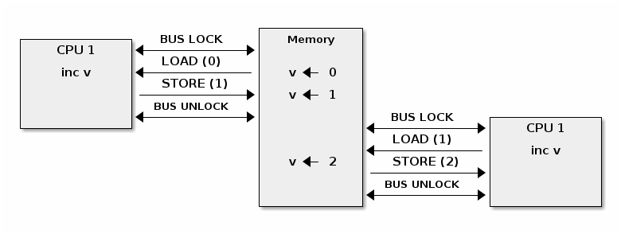

* [目次](/README.md#目次index)
* [割り込み](/interrupts.rst.md#割り込み)

---

## 対照型マルチプロセッシング

### この講義の目的

   * カーネルの並列処理

   * アトミックな操作

   * スピン・ロック

   * キャッシュのスラッシング（*thrashing*）

   * 最適化したスピン・ロック

   * プロセスと割り込みコンテキストの同期

   * ミューテックス（*Mutexes*）

   * CPU ごとのデータ

   * メモリ・オーダリング（*Ordering*）とメモリ・バリア（*Barrier*）

   * リード・コピー・アップデート（*Read-Copy Update*）


### 同期の基本

Linux カーネルが「対照型マルチプロセッシング（**SMP**）」をサポートしているので、一連の同期メカニズムを使用して競合状態のない期待したとおりの結果を出してあげる必要があります。


---

##### Note

この講義では「コア（*Core*）」と「CPU」 と「プロセッサ」という用語を同じ意味で使用しています。

---


次に示す二つの状態が同時に発生すると競合状態になる可能性があります：

   1. 「並列」実行される実行コンテキストが最低二つ存在する状態:

     * 完全に並列実行する（例: 二つのシステム・コールが別々のプロセッサで処理される）

     * 複数ある実行コンテキストの一つが他の実行コンテキストを任意にプリエンプトする（CPU の実行権を奪う）（例： 割り込みがシステム・コールをプリエンプトする）

   1. 実行コンテキストが共有メモリに対して読み書きのアクセスを実行している状態

競合状態は、実行コンテキストが CPU コア上でかなり特殊な順番でスケジューリングされた時にだけ出現するので、デバッグが困難で間違った結果につながる可能性があります。

ここに、古典的な競合状態の例として間違ったリソース・カウンタの実装を持ったリソースの解放処理があります：

```c

      void release_resource()
      {
          counter--;

          if (!counter)
              free_resource();
      }
```

リソース・カウンタは共有リソースを最後の使用者が解放するまで利用できるようにしておくための仕組みですが、上記の実装には競合状態になるとリソースを二回解放する問題があります。


通常、``release_resource()`` 関数はリソースを一度だけ解放します。
しかし上の例で、``counter`` を一つ減らした直後にスレッド A がプリエンプトされ、代わりにスレッド B が ``release_resource()`` を呼び出した場合でもリソースが解放されます。
それからスレッド A に制御が戻ったら、``counter`` は 0 なのでリソースが解放されてしまいます（これがリソース解放が二回行われる問題です）。

この競合状態を回避するには、プログラマはまずその競合状態を生み出す「クリティカル・セクション（*Critical Section*）」を特定する必要があります。
クリティカル・セクションは複数の並列コンテキストから共有メモリを読み書きするコードの一部です。

上の例で言うと、最小のクリティカル・セクションは ``counter`` を一つ減らす処理から、``counter`` の値を確認するまでです。

一度、クリティカル・セクションを特定したら、次のいずれか一つの方法で競合状態を回避できます：

   * クリティカル・セクションを **アトミック（*atomic*）** にする（例： アトミックな命令を使う）

   * クリティカル・セクションの間は **プリエンプトを無効にする** （例：割り込みやボトム・ハーフのハンドラ、あるいはスレッドのプリエンプトを無効にする）

   * クリティカル・セクションに対する **アクセスをシリアル化する** （例：スピン・ロックやミューテックスを使用し、クリティカル・セクションを実行できるコンテキストやスレッドを一個だけに限定する）


### Linux カーネルのいろいろな並列処理（*Linux kernel concurrency sources*）

Linux カーネルにはカーネルの設定と、そのカーネルを実行するシステムの種類に応じた並列処理が複数あります：

   * **シングル・コアのシステム** ＋ **非プリエンプティブ・カーネル**: 現在のプロセスは割り込みによってプリエンプト（実行が中断）することが可能

   * **シングル・コアのシステム** ＋  **プリエンプティブ・カーネル**: 上記に加え、現在のプロセスは他のプロセスによってプリエンプト（実行が中断）することが可能

   * **マルチ・コアのシステム**: 上記に加え、現在のプロセスは別のプロセスまたは別のプロセッサで実行中の割り込みと平行して実行することが可能


---

##### Note

この講義ではカーネルの並列処理についてのみ説明します。シングル・コアのシステムで動いている非プリエンプティブ・カーネルの場合、プロセスと並列で処理されるのは割り込み処理だけになります。

---


### アトミックな操作（*Atomic operations*）

特定の状況ではハードウェアが提供する「アトミックな操作（*Atomic operations*)」を使えば競合状態を回避することは可能です。
Linux ではアトミックな操作にアクセスするための（ハードウェアに依存しない）統一的な API を提供しています：

   * 整数系:

     * 簡易版: ``atomic_inc()``、``atomic_dec()``、``atomic_add()``, ``atomic_sub()``

     * 条件付き: ``atomic_dec_and_test()``、``atomic_sub_and_test()``

   * ビット系:

     * 簡易版: ``test_bit()``、``set_bit()``、``change_bit()``

     * 条件付き: ``test_and_set_bit()``、``test_and_clear_bit()``、``test_and_change_bit()``


例えば ``atomic_dec_and_test()`` という関数を使って、リソース・カウンタを一つ減らしその値をチェックするという一連のアトミックな処理を実装できます。

```c

      void release_resource()
      {
          if (atomic_dec_and_test(&counter))
               free_resource();
      }
```

アトミックな操作に伴う複雑さの一つがマルチ・コアシステムで発生するという点です。すなわち、アトミックな操作はシステム・レベルではアトミックではなくなるということです（但し、コア・レベルでは依然としてアトミックです）。

この理由を理解するために、アトミックな操作をメモリのロードとストアの操作に分解する必要があります。
すると、ロードとストアの命令が複数の CPU 間で交互に処理されるような状態で競合状態が発生するシナリオを作ることができます。
例えば、一つの値を二つのプロセッサを使ってカウントアップすると予期しない結果が生じるといった以下の例のようなものです：


SMP のシステムでアトミックな操作を提供するために、異なるアーキテクチャがそれぞれ異なる方法を採用しています。
例えば x86 アーキテクチャの場合は ``LOCK`` という接頭詞を使い、この接頭詞が付いている操作を実行している間はシステムバスをロックします：





ARM アーキテクチャの場合は ``LDREX`` 命令と ``STREX`` 命令を一緒に使用してアトミックなアクセスを保証しています。
``LDREX`` 命令は値をロードしアトミックな操作が進行中であることを「排他モニタ（*Exclusive Monitor*）」に通知します。
次に ``STREX`` 命令が新しい値をストアしようとしますが、排他モニタが他の排他処理を検出していなかった場合にのみストアが成功します。
したがって、アトミックな操作を実現するためにプログラマは、排他モニタが排他処理可能であることを通知するまで（``LDREX`` と ``STREX`` の両方の）処理をリトライさせる必要があります。

この方式はしばしば「軽量な」または「効率が良い」同期メカニズムとして解釈されます
（その理由は「この方式がスピン・ロックやコンテキスト・スイッチが不要だから」とか、「この方式がハードウェアの実装なので、もっと効率よくなるはずだ」とか、「この方式はただの命令なので、他の命令と同様に効率がよくないといけない」というものがあります）。
しかし実装の詳細を見るとわかるように、アトミックな操作は実際には「コストが高い」処理であることがわかります。


### プリエンプティブ機能の無効化（割り込み）

（前述のとおり、）シングル・コアのシステムで非プリエンプティブなカーネルにおける並列処理とは、現在のスレッドが一個の割り込みによってプリエンプト（実行が中断）されるケースしかありません。
したがって並列処理にならないようにするには割り込みを無効（*Disabling*）にするだけで事が足ります。

これはアーキテクチャ毎に専用の命令を実行することで実現されていますが、Linux では「アーキテクチャに依存せずに」割り込みを無効にしたり有効する API をいくつか提供しています：

```c
       #define local_irq_disable() \
           asm volatile („cli” : : : „memory”)

      #define local_irq_enable() \
          asm volatile („sti” : : : „memory”)

      #define local_irq_save(flags) \
          asm volatile ("pushf ; pop %0" :"=g" (flags)
                        : /* no input */: "memory") \
          asm volatile("cli": : :"memory")

      #define local_irq_restore(flags) \
          asm volatile ("push %0 ; popf"
                        : /* no output */
                        : "g" (flags) :"memory", "cc");
```

割り込みは ``local_irq_disable()`` と ``local_irq_enable()`` マクロで明示的に有効にしたり無効にすることができますが、これらの API は現在の状態（APIを呼び出す時の状態）と何の割り込みなのかが分かっている場合にのみ使用して下さい。
これらは、通常は（割り込み処理といった）カーネル・コードのコア部で使用されます。

並列処理に伴う問題のために割り込みそのものを回避したいという典型的なケースでは、``local_irq_save()`` と ``local_irq_restore()`` 系の関数の使用が推奨されています。
これらは割り込みの状態を保存したり復元する関数ですが、これらの関数を正しく呼び出している限り**【訳注１】**、クリティカル・セクションで作業している最中に誤って割り込みを有効にしてしまうといったリスクを犯すことなく、重複するクリティカル・セクションから自由に呼び出すことができます。

**【訳注１】**

保存（``local_irq_save()``）と復元（``local_irq_restore()``）の呼び出し回数がそれぞれ同じである状態


### スピン・ロック

「**スピン・ロック**（*Spin Lock*）」はクリティカル・セクションへのアクセスをシリアル化（*serialize*）する**【訳注２】**際に使用します。

**【訳注２】**

順番付けする。クリティカル・セクションへのアクセスを順番ずつにする。

これは、真の並行処理が可能なマルチ・コアシステムで必要となるメカニズムです。
次が典型的なスピン・ロックの実装です：


```asm

      spin_lock:
          lock bts [my_lock], 0
	  jc spin_lock

      /* クリティカル・セクション */

      spin_unlock:
          mov [my_lock], 0
```

   **bts dts, src** - （*bit test and set*）この命令は ``dts`` のメモリ・アドレスから ``src`` ビットをキャリー・フラグ ``CF`` にコピーして、それをセットする

```c

      CF <- dts[src]
      dts[src] <- 1
```

ご覧のとおり、スピン・ロックはアトミック命令を使って、クリティカル・セクションに入ることができるコアは一つだけであることを保証します。
もし複数のコアがクリティカル・セクションに入ろうとしたら、ロックが解放されるまで、コアはそれこそぶっ続けに「スピン」し続けます。

   * 少なくとも１個のコアがクリティカル・セクションのロックに入ろうとするとロックの競合が発生する

   * ロックの競合は、クリティカル・セクションの規模、クリティカル・セクションで費やした時間, そしてシステム内のコア数とともに大きくなる

スピン・ロックにあるもう一つの（マイナス面の）副作用はキャッシュのスラッシング（Cache Thrashing）です。

キャッシュのスラッシングは、複数のコアが同じメモリを読み書きした結果、過度なキャッシュ・ミスが起こった場合に発生します。

スピン・ロックはロックの競合中にメモリに連続的にアクセスするため、「キャッシュ・コヒーレンス（*Cache Coherence*）」が実装されているが故にキャッシュ・スラッシングがよく発生します。


### マルチ・プロセッサ型のシステムにおけるキャッシュ・コヒーレンス（*Cache Coherence*）

マルチ・プロセッサ型のシステムにおける物理メモリはローカル CPU のキャッシュ（L1 キャッシュ）、共有 CPU のキャッシュ（L2 キャッシュ）、そしてメイン・メモリから構成されています。
ここでキャッシュ・コヒーレンスを説明するために L2 キャッシュを無視し、L1 キャッシュとメイン・メモリだけ考慮することにします。

下の図は、変数Aと変数Bがそれぞれ異なるキャッシュ・ラインに分類され、キャッシュとメイン・メモリが同期されているメモリの階層の状態を示しています：


キャッシュとメイン・メモリの間で同期するメカニズムが無い場合、CPU0 が ``A = A + B`` を実行し、CPU1 が ``B = A + B`` をそれぞれ実行すると、上の状態は次のようになります：


上の図のような状態を回避するために、マルチ・プロセッサ型のシステムはキャッシュ・コヒーレンスを使用します。
このキャッシュ・コヒーレンスには主に二つの種類があります：

   * バス・スヌーピング（*Bus Snooping / Sniffing*）系：メモリ・バスのトランザクションがキャッシュによって監視され、一貫性（コヒーレンス）を維持するためのアクションを実行する

   * ディレクトリ系： キャッシュの状態を維持する別のディレクトリがある：
     キャッシュはディレクトリと相互に作用して一貫性（コヒーレンス）を維持する

バス・スヌーピングは他と比較してメカニズムは単純ですが、コア数が 32〜64 を超えるとパフォーマンスが低下します。

ディレクトリ系のキャッシュ・コヒーレンスは他と比較してはるかに優れており（コア数は最大数千個）、NUMA システムでも標準の機能です。


A simple cache coherency protocol that is commonly used in practice is MESI (named after the acronym of the cache line states names:
**Modified**, **Exclusive**, **Shared** and **Invalid**).
It's main characteristics are:

   * Caching policy: write back

   * Cache line states

     * Modified: owned by a single core and dirty

     * Exclusive: owned by a single core and clean

     * Shared: shared between multiple cores and clean

     * Invalid : the line is not cached

Issuing read or write requests from CPU cores will trigger state transitions, as exemplified below:

   * Invalid -> Exclusive: read request, all other cores have the line in Invalid;
     line loaded from memory

   * Invalid -> Shared: read request, at least one core has the line in Shared or Exclusive;
     line loaded from sibling cache

   * Invalid/Shared/Exclusive -> Modified: write request; **all other** cores **invalidate** the line

   * Modified -> Invalid: write request from other core;
     line is flushed to memory


---

##### Note

The most important characteristic of the MESI protocol is that it is a write-invalidate cache protocol.
When writing to a shared location all other caches are invalidated.

---

This has important performance impact in certain access patterns, and one such pattern is contention for a simple spin lock implementation like we discussed above.

To exemplify this issue lets consider a system with three CPU cores, where the first has acquired the spin lock and it is running the critical section while the other two are spinning waiting to enter the critical section:


      +-------+                     +-------+                  +-------+
      | CPU 0 |<---------------+    | CPU 1 |   Invalidate     | CPU 0 |
      | cache |<-------------+ |    | cache |<---+ +---------->| cache |
      +-------+  Invalidate  | |    +-------+    | |           +-------+
                             | |                 | |
                             | |                 +----------------------------+
      spin_lock(&lock);      | |                   |                          |
                             | |     READ lock     |                          |
                             | +---- WRITE lock ---+                          |
                             |                                                |
                             |                                 READ lock      |
                             +-------------------------------- WRITE lock ----+

         ...                            ...                       ...
      READ data                      READ lock                 READ lock
          |                              |                         |
          |                              |                         |
          |                              |                         |
          +------------------------------+-------------------------+
                                         |
                                         v

                                    cache miss

As it can be seen from the figure above due to the writes issued by the cores spinning on the lock we see frequent cache line invalidate operations which means that basically the two waiting cores will flush and load the cache line while waiting for the lock, creating unnecessary traffic on the memory bus and slowing down memory accesses for the first core.

Another issue is that most likely data accessed by the first CPU during the critical section is stored in the same cache line with the lock
(common optimization to have the data ready in the cache after the lock is acquired).

Which means that the cache invalidation triggered by the two other spinning cores will slow down the execution of the critical section which in turn triggers more cache invalidate actions.

Optimized spin locks
====================

As we have seen simple spin lock implementations can have poor
performance issues due to cache thrashing, especially as the number of
cores increase. To avoid this issue there are two possible strategies:

* reduce the number of writes and thus reduce the number of cache
  invalidate operations

* avoid the other processors spinning on the same cache line, and thus
  avoid the cache invalidate operations


An optimized spin lock implementation that uses the first approach is
presented below:

.. slide:: Optimized spin lock (KeAcquireSpinLock)
   :inline-contents: True
   :level: 2

   |_|

   .. code-block:: asm

      spin_lock:
          rep ; nop
          test lock_addr, 1
          jnz spin_lock
          lock bts lock_addr
          jc spin_lock


   * we first test the lock read only, using a non atomic
     instructions, to avoid writes and thus invalidate operations
     while we spin

   * only when the lock *might* be free, we try to acquire it

The implementation also use the **PAUSE** instruction to avoid
pipeline flushes due to (false positive) memory order violations and
to add a small delay (proportional with the memory bus frequency) to
reduce power consumption.

A similar implementation with support for fairness (the CPU cores are
allowed in the critical section based on the time of arrival) is used
in the Linux kernel (the `ticket spin lock <https://lwn.net/Articles/267968/>`_)
for many architectures.

However, for the x86 architecture, the current spin lock
implementation uses a queued spin lock where the CPU cores spin on
different locks (hopefully distributed in different cache lines) to
avoid cache invalidation operations:


           +-------------------------------------------+
           |              Queued Spin Lock        cEEE |
           |                                           |
           |   +---+      +---+      +---+      +---+  |
           |   |   |----->|   |----->|   |----->|   |  |
           |   +---+      +---+      +---+      +---+  |
           |     ^          ^          ^          ^    |
           |     |          |          |          |    |
           +-------------------------------------------+
                 |          |	       |          |
               CPU10      CPU17       CPU99     CPU0
              owns the   spins on    spins on  spins on
               lock      private     private   private
                          lock        lock      lock


Conceptually, when a new CPU core tries to acquire the lock and it
fails it will add its private lock to the list of waiting CPU
cores. When the lock owner exits the critical section it unlocks the
next lock in the list, if any.

While a read spin optimized spin lock reduces most of the cache
invalidation operations, the lock owner can still generate cache
invalidate operations due to writes to data structures close to the
lock and thus part of the same cache line. This in turn generates
memory traffic on subsequent reads on the spinning cores.

Hence, queued spin locks scale much better for large number of cores
as is the case for NUMA systems. And since they have similar fairness
properties as the ticket lock it is the preferred implementation on
the x86 architecture.


Process and Interrupt Context Synchronization
=============================================

Accessing shared data from both process and interrupt context is a
relatively common scenario. On single core systems we can do this by
disabling interrupts, but that won't work on multi-core systems,
as we can have the process running on one CPU core and the interrupt
context running on a different CPU core.

Using a spin lock, which was designed for multi-processor systems,
seems like the right solution, but doing so can cause common
deadlock conditions, as detailed by the following scenario:


.. slide:: Process and Interrupt Handler Synchronization Deadlock
   :inline-contents: True
   :level: 2

   * In the process context we take the spin lock

   * An interrupt occurs and it is scheduled on the same CPU core

   * The interrupt handler runs and tries to take the spin lock

   * The current CPU will deadlock


To avoid this issue a two fold approach is used:


.. slide:: Interrupt Synchronization for SMP
   :inline-contents: True
   :level: 2

   * In process context: disable interrupts and acquire a spin lock;
     this will protect both against interrupt or other CPU cores race
     conditions (:c:func:`spin_lock_irqsave` and
     :c:func:`spin_lock_restore` combine the two operations)

   * In interrupt context: take a spin lock; this will will protect
     against race conditions with other interrupt handlers or process
     context running on different processors


We have the same issue for other interrupt context handlers such as
softirqs, tasklets or timers and while disabling interrupts might
work, it is recommended to use dedicated APIs:

.. slide:: Bottom-Half Synchronization for SMP
   :inline-contents: True
   :level: 2

   * In process context use :c:func:`spin_lock_bh` (which combines
     :c:func:`local_bh_disable` and :c:func:`spin_lock`) and
     :c:func:`spin_unlock_bh` (which combines :c:func:`spin_unlock` and
     :c:func:`local_bh_enable`)

   * In bottom half context use: :c:func:`spin_lock` and
     :c:func:`spin_unlock` (or :c:func:`spin_lock_irqsave` and
     :c:func:`spin_lock_irqrestore` if sharing data with interrupt
     handlers)


As mentioned before, another source of concurrency in the Linux kernel
can be other processes, due to preemption.

.. slide:: Preemption
   :inline-contents: True
   :level: 2

   |_|

   Preemption is configurable: when active it provides better latency
   and response time, while when deactivated it provides better
   throughput.

   Preemption is disabled by spin locks and mutexes but it can be
   manually disabled as well (by core kernel code).


As for local interrupt enabling and disabling APIs, the bottom half
and preemption APIs allows them to be used in overlapping critical
sections. A counter is used to track the state of bottom half and
preemption. In fact the same counter is used, with different increment
values:

.. slide:: Preemption and Bottom-Half Masking
   :inline-contents: True
   :level: 2

   .. code-block:: c

      #define PREEMPT_BITS      8
      #define SOFTIRQ_BITS      8
      #define HARDIRQ_BITS      4
      #define NMI_BITS          1

      #define preempt_disable() preempt_count_inc()

      #define local_bh_disable() add_preempt_count(SOFTIRQ_OFFSET)

      #define local_bh_enable() sub_preempt_count(SOFTIRQ_OFFSET)

      #define irq_count() (preempt_count() & (HARDIRQ_MASK | SOFTIRQ_MASK))

      #define in_interrupt() irq_count()

      asmlinkage void do_softirq(void)
      {
          if (in_interrupt()) return;
          ...


Mutexes
=======

Mutexes are used to protect against race conditions from other CPU
cores but they can only be used in **process context**. As opposed to
spin locks, while a thread is waiting to enter the critical section it
will not use CPU time, but instead it will be added to a waiting queue
until the critical section is vacated.

Since mutexes and spin locks usage intersect, it is useful to compare
the two:

.. slide:: Mutexes
   :inline-contents: True
   :level: 2

   * They don't "waste" CPU cycles; system throughput is better than
     spin locks if context switch overhead is lower than medium
     spinning time

   * They can't be used in interrupt context

   * They have a higher latency than spin locks

Conceptually, the :c:func:`mutex_lock` operation is relatively simple:
if the mutex is not acquired we an take the fast path via an atomic
exchange operation:


.. slide:: :c:func:`mutex_lock` fast path
   :inline-contents: True
   :level: 2

   .. code-block:: c

      void __sched mutex_lock(struct mutex *lock)
      {
        might_sleep();

        if (!__mutex_trylock_fast(lock))
          __mutex_lock_slowpath(lock);
      }

      static __always_inline bool __mutex_trylock_fast(struct mutex *lock)
      {
        unsigned long curr = (unsigned long)current;

        if (!atomic_long_cmpxchg_acquire(&lock->owner, 0UL, curr))
          return true;

        return false;
      }


otherwise we take the slow path where we add ourselves to the mutex
waiting list and put ourselves to sleep:

.. slide:: :c:func:`mutex_lock` slow path
   :inline-contents: True
   :level: 2

   .. code-block:: c

      ...
        spin_lock(&lock->wait_lock);
      ...
        /* add waiting tasks to the end of the waitqueue (FIFO): */
        list_add_tail(&waiter.list, &lock->wait_list);
      ...
        waiter.task = current;
      ...
        for (;;) {
	  if (__mutex_trylock(lock))
	    goto acquired;
        ...
	  spin_unlock(&lock->wait_lock);
	...
          set_current_state(state);
      	  spin_lock(&lock->wait_lock);
        }
        spin_lock(&lock->wait_lock);
      acquired:
        __set_current_state(TASK_RUNNING);
        mutex_remove_waiter(lock, &waiter, current);
        spin_lock(&lock->wait_lock);
      ...

The full implementation is a bit more complex: instead of going to
sleep immediately it optimistic spinning if it detects that the lock
owner is currently running on a different CPU as chances are the owner
will release the lock soon. It also checks for signals and handles
mutex debugging for locking dependency engine debug feature.


The :c:func:`mutex_unlock` operation is symmetric: if there are no
waiters on the mutex then we an take the fast path via an atomic exchange
operation:

.. slide:: :c:func:`mutex_unlock` fast path
   :inline-contents: True
   :level: 2

   .. code-block:: c

      void __sched mutex_unlock(struct mutex *lock)
      {
	if (__mutex_unlock_fast(lock))
	  return;
	__mutex_unlock_slowpath(lock, _RET_IP_);
      }

      static __always_inline bool __mutex_unlock_fast(struct mutex *lock)
      {
	unsigned long curr = (unsigned long)current;

	if (atomic_long_cmpxchg_release(&lock->owner, curr, 0UL) == curr)
	  return true;

	return false;
      }

      void __mutex_lock_slowpath(struct mutex *lock)
      {
      ...
        if (__mutex_waiter_is_first(lock, &waiter))
		__mutex_set_flag(lock, MUTEX_FLAG_WAITERS);
      ...


.. note:: Because :c:type:`struct task_struct` is cached aligned the 7
          lower bits of the owner field can be used for various flags,
          such as :c:type:`MUTEX_FLAG_WAITERS`.


Otherwise we take the slow path where we pick up first waiter from the
list and wake it up:

.. slide:: :c:func:`mutex_unlock` slow path
   :inline-contents: True
   :level: 2

   .. code-block:: c

      ...
      spin_lock(&lock->wait_lock);
      if (!list_empty(&lock->wait_list)) {
        /* get the first entry from the wait-list: */
        struct mutex_waiter *waiter;
        waiter = list_first_entry(&lock->wait_list, struct mutex_waiter,
                                  list);
	next = waiter->task;
	wake_q_add(&wake_q, next);
      }
      ...
      spin_unlock(&lock->wait_lock);
      ...
      wake_up_q(&wake_q);


Per CPU data
============

Per CPU data avoids race conditions by avoiding to use shared
data. Instead, an array sized to the maximum possible CPU cores is
used and each core will use its own array entry to read and write
data. This approach certainly has advantages:


.. slide:: Per CPU data
   :inline-contents: True
   :level: 2

   * No need to synchronize to access the data

   * No contention, no performance impact

   * Well suited for distributed processing where aggregation is only
     seldom necessary (e.g. statistics counters)


Memory Ordering and Barriers
============================

Modern processors and compilers employ out-of-order execution to
improve performance. For example, processors can execute "future"
instructions while waiting for current instruction data to be fetched
from memory.

Here is an example of out of order compiler generated code:

.. slide:: Out of Order Compiler Generated Code
   :inline-contents: True
   :level: 2

   +-------------------+-------------------------+
   | C code            | Compiler generated code |
   +-------------------+-------------------------+
   |.. code-block:: c  |.. code-block:: asm      |
   |		       |			 |
   |   a = 1;          |  MOV R10, 1		 |
   |   b = 2;          |  MOV R11, 2		 |
   |                   |  STORE R11, b		 |
   |                   |  STORE R10, a		 |
   +-------------------+-------------------------+


.. note:: When executing instructions out of order the processor makes
          sure that data dependency is observed, i.e. it won't execute
          instructions whose input depend on the output of a previous
          instruction that has not been executed.

In most cases out of order execution is not an issue. However, in
certain situations (e.g. communicating via shared memory between
processors or between processors and hardware) we must issue some
instructions before others even without data dependency between them.

For this purpose we can use barriers to order memory operations:

.. slide:: Barriers
   :inline-contents: True
   :level: 2

   * A read barrier (:c:func:`rmb()`, :c:func:`smp_rmb()`) is used to
     make sure that no read operation crosses the barrier; that is,
     all read operation before the barrier are complete before
     executing the first instruction after the barrier

   * A write barrier (:c:func:`wmb()`, :c:func:`smp_wmb()`) is used to
     make sure that no write operation crosses the barrier

   * A simple barrier (:c:func:`mb()`, :c:func:`smp_mb()`) is used
     to make sure that no write or read operation crosses the barrier


Read Copy Update (RCU)
======================

Read Copy Update is a special synchronization mechanism similar with
read-write locks but with significant improvements over it (and some
limitations):

.. slide:: Read Copy Update (RCU)
   :level: 2
   :inline-contents: True

   * **Read-only** lock-less access at the same time with write access

   * Write accesses still requires locks in order to avoid races
     between writers

   * Requires unidirectional traversal by readers


In fact, the read-write locks in the Linux kernel have been deprecated
and then removed, in favor of RCU.

Implementing RCU for a new data structure is difficult, but a few
common data structures (lists, queues, trees) do have RCU APIs that
can be used.

RCU splits removal updates to the data structures in two phases:

.. slide:: Removal and Reclamation
   :inline-contents: True
   :level: 2

   * **Removal**: removes references to elements. Some old readers may
     still see the old reference so we can't free the element.

   * **Elimination**: free the element. This action is postponed until
     all existing readers finish traversal (quiescent cycle). New
     readers won't affect the quiescent cycle.


As an example, lets take a look on how to delete an element from a
list using RCU:


         (1) List Traversal                          (2) Removal
                                                    +-----------+
      +-----+     +-----+     +-----+      +-----+  |  +-----+  |  +-----+
      |     |     |     |     |     |      |     |  |  |     |  |  |     |
      |  A  |---->|  B  |---->|  C  |      |  A  |--+  |  B  |--+->|  C  |
      |     |     |     |     |     |      |     |     |     |     |     |
      +-----+     +-----+     +-----+      +-----+     +-----+     +-----+
         ^           ^           ^            ^           ^           ^
         |           |           |            |           |           |


         (3) Quiescent cycle over                 (4) Reclamation
               +-----------+
      +-----+  |  +-----+  |  +-----+      +-----+                 +-----+
      |     |  |  |     |  |  |     |      |     |                 |     |
      |  A  |--+  |  B  |  +->|  C  |      |  A  |---------------->|  C  |
      |     |     |     |     |     |      |     |                 |     |
      +-----+     +-----+     +-----+      +-----+                 +-----+
         ^                       ^            ^                       ^
         |                       |            |                       |


In the first step it can be seen that while readers traverse the list
all elements are referenced. In step two a writer removes
element B. Reclamation is postponed since there are still readers that
hold references to it. In step three a quiescent cycle just expired
and it can be noticed that there are no more references to
element B. Other elements still have references from readers that
started the list traversal after the element was removed. In step 4 we
finally perform reclamation (free the element).


Now that we covered how RCU functions at the high level, lets looks at
the APIs for traversing the list as well as adding and removing an
element to the list:


.. slide:: RCU list APIs cheat sheet
   :inline-contents: True
   :level: 2

   .. code-block:: c

      /* list traversal */
      rcu_read_lock();
      list_for_each_entry_rcu(i, head) {
        /* no sleeping, blocking calls or context switch allowed */
      }
      rcu_read_unlock();


      /* list element delete  */
      spin_lock(&lock);
      list_del_rcu(&node->list);
      spin_unlock(&lock);
      synchronize_rcu();
      kfree(node);

      /* list element add  */
      spin_lock(&lock);
      list_add_rcu(head, &node->list);
      spin_unlock(&lock);

