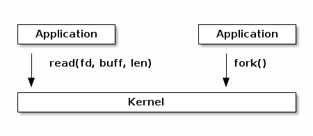
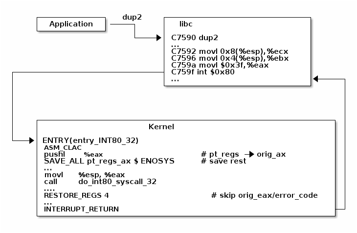

* [目次](/README.md#目次index)

---

## システム・コール

### この講義の目的

   * Linux のシステム・コールの実装

   * VDSO と仮想システム・コール

   * システム・コールからユーザ空間へのアクセス方法


### Linux のシステム・コールの実装

高位のレベルにあるシステム・コールは、カーネルからユーザ空間にあるアプリケーションに提供される「サービス群」であり、名前と引数と返り値を持つ関数呼び出しとして記述されている点で言うと、ユーザ空間にあるライブラリの API に似ています。



しかし、よく見てみると、システム・コールは実際には関数呼び出しではなく、次のようなことを実行する（アーキテクチャとカーネル固有の）特別なアセンブリ命令であることがわかります：

   * システム・コールとその引数を識別するための情報をセットする

   * カーネル・モードに切り替える

   * システム・コールの結果を受け取る

Linux のシステム・コールは番号で識別され、システム・コールに渡す引数のサイズはマシンのワード単位（32 または 64-ビット）になります。
システム・コールには最大で6つの引数を渡すことができます。
システム・コールと引数の両方が特定のレジスタに格納されます。

例えば 32-ビットの x86 アーキテクチャの場合、システム・コールの識別番号は EAX レジスタに格納され、システム・コールに渡す引数はそれぞれ EBX、ECX、EDX、ESI、EDI、EBP レジスタに格納されます。

glibc などのシステム・ライブラリが提供している関数は実際のシステム・コールを呼び出す実装になっているので、アプリケーションからシステムコールを簡単に利用できるようになっています。

CPU の実行モードがユーザ・モードからカーネル・モードに遷移すると、実行中のコードの流れが中断されてカーネルのエントリ・ポイントに転送されます。
これは割り込みや例外の対応方法と似ています
（実際、一部のアーキテクチャでは、この遷移が例外の結果として発生する実装になっています）。

システム・コールを開始するエントリ・ポイントでは、まず複数のレジスタ
（これらのレジスタにはユーザ空間からセットされた値、システム・コールの識別番号、そして引数が格納されている）
の内容をスタックに保存してから、システム・コールのディスパッチャの実行を継続します。


##### Note

ユーザ・モードからカーネル・モードへ遷移すると、スタックもユーザ空間のスタックからカーネル空間のスタックに切り替わります。
ここでは「割り込み」の講義で使用した例を引用します：

###### ***Linuxのシステム・コールをセットアップして処理する例***



システム・コール・ディスパッチャの目的はシステム・コールの識別番号を確認し、そのシステム・コールに関連づけられたカーネル関数を実行することです。


* Linux システム・コール・ディスパッチャの実装（一部）

```c

      /* Handles int $0x80 */
      __visible void do_int80_syscall_32(struct pt_regs *regs)
      {
	  enter_from_user_mode();
	  local_irq_enable();
	  do_syscall_32_irqs_on(regs);
      }

      /* simplified version of the Linux x86 32bit System Call Dispatcher */
      static __always_inline void do_syscall_32_irqs_on(struct pt_regs *regs)
      {
	  unsigned int nr = regs->orig_ax;

	  if (nr < IA32_NR_syscalls)
	      regs->ax = ia32_sys_call_table[nr](regs->bx, regs->cx,
	                                         regs->dx, regs->si,
	                                         regs->di, regs->bp);
	  syscall_return_slowpath(regs);
      }
```

システム・コールの実行フローをデモする為に、仮想マシンを用意して実行中のカーネルを ``gdb`` でアタッチして、``dup2()`` というシステム・コールにブレークポイントを追加して、その状態を調査してみて下さい。

* ``dup2()`` システム・コールの調査の動画（**syscalls-inspection.cast**) HERE


要約すると、システム・コールの実行フローは次のとおりです：

   * アプリケーションはシステム・コールの番号と引数を指定してから ``trap()`` 命令を呼び出す

   * 実行モードがユーザからカーネルに切り替わる ; CPU がカーネルのスタックに切り替える ; ユーザ空間のスタックと戻り先のアドレスがカーネルのスタックに保存される

   * カーネルのエントリーポイントがカーネルのスタック上にいろいろなレジスタの値を保存する

   * システム・コール・ディスパッチャがシステム・コールに対応づけられた関数を識別して呼び出す

   * ユーザ空間のレジスタの状態が復元され、実行フローがユーザ空間に戻される（例えば ``IRET`` 命令を実行する)

   * 割り込まれていたユーザ空間のアプリケーションが実行を再開する


#### システム・コール・テーブル

「システム・コール・テーブル」は、いろいろなシステム・コールの識別番号とカーネル関数を対応付けするために、システム・コール・ディスパッチャによって使用されるものです：

```c

      #define __SYSCALL_I386(nr, sym, qual) [nr] = sym,

      const sys_call_ptr_t ia32_sys_call_table[] = {
        [0 ... __NR_syscall_compat_max] = &sys_ni_syscall,
        #include <asm/syscalls_32.h>
      };
```

```c
      __SYSCALL_I386(0, sys_restart_syscall, )
      __SYSCALL_I386(1, sys_exit, )
      #ifdef CONFIG_X86_32
      __SYSCALL_I386(2, sys_fork, )
      #else
      __SYSCALL_I386(2, sys_fork, )
      #endif
      __SYSCALL_I386(3, sys_read, )
      __SYSCALL_I386(4, sys_write, )
```


#### システム・コールの引数の扱い

システム・コールの引数の取り扱いは少し注意が必要です。
これらの値はユーザ空間から渡されるため、カーネルはそれらの妥当性を想定することができず、常にそれらを徹底的に検証してやる必要があります。

ポインタには、必ず確認すべき重要で特別な場面がいくつかあります：

   * 絶対にポインタはカーネル空間のメモリを指してはいけない
   * ポインタが無効であるかどうかを確認すること

システム・コールはカーネル・モードで実行されるため、システム・コールがカーネル空間へのアクセス権を持ち、もしいろいろなポインタが無効かどうか不明な場合は、ユーザ空間のアプリケーションはカーネル空間への読み込みまたは書き込み権限を取得する可能性があります。
例として、``read()`` や ``write()`` のシステム・コールに対してこのような確認が行われなかった場合について考えてみることにしましょう。
ユーザが ``write()`` システム・コールにカーネル空間へのポインタを渡すと、あとでファイルを読み込むことによってカーネルにあるデータにアクセスできるようになります。
ユーザが ``read()`` システム・コールにカーネル空間へのポインタを渡すと、カーネルのメモリを破壊する可能性があります。

同様に、アプリケーションから渡されたポインタが無効（例えば物理アドレスにマップされていない、書き込みに使用するため一時的に読み込み専用になっているなど）な場合は、カーネルが「クラッシュ」する可能性があります。
このような場合に使えるオススメの方法が二つあります：

   * カーネル空間で参照する前に、ユーザのアドレス空間と照合する、または
   * ポインタを直接確認するのではなく、MMU を使ってポインタが無効であることを検出させ、ページ・フォルト・ハンドラを使ってそのポインタが無効なものであると判断する

これらは魅力的に見えるかもしれませんが、二つ目の方法はそれほど簡単には実装できません。
ページ・フォルト・ハンドラは「フォルトしたアドレス」（アクセスしたアドレス）と「フォルトさせたアドレス」（アクセスを行なった命令が格納されているアドレス）、そしてユーザ空間からの情報を使用してページ・フォルトした原因を特定します：

   * 「コピー・オン・ライト」や「デマンド・ページング」や「スワップ」:フォルトしたアドレスとフォルトさせたアドレスは共にユーザ空間にある ; フォルトしたアドレスは有効なポインタである（ユーザ空間のアドレスに対して確認される）
   
   * システム・コールで使用する無効なポインタ：フォルトさせたアドレスはカーネル空間にある；フォルトしたアドレスはユーザ空間にあり、これが無効なポインタである

   * カーネルのバグ（カーネルが無効なポインタにアクセスする）：上と同じ

しかしながら、二番目と三番目の場面にはフォルトした原因を特定するために必要な情報が不足しています。

このような場合を解決するために Linux では特別な API（例えば ``copy_to_user()`` 関数）を使って特別に作成されたユーザ空間にアクセスします：

   * ユーザ空間にアクセスする実際の命令は「例外テーブル」に記録されている

   * ページ・フォルトが発生したら、この例外テーブルと「フォルトさせたアドレス」を照合する

フォルトを処理する場合はアドレス空間のサイズ vs 例外テーブルのサイズの結果によっては全体的にコストが高くなる可能性があり、さらに複雑になりますが、一般的な処理として最適化されているため Linux では使用が推奨されたものになっています。

##### ポインタを確認する vs フォルト処理を使うコスト分析

コスト| ポインタを確認する方法 | フォルト処理を使う方法
------------ | ------------- | ------------
有効なアドレス | アドレス空間の検索 | 無視できるほど小さい
無効なアドレス | アドレス空間の検索 | 例外テーブルの検索


### 仮想動的共有オブジェクト（vDSO）

The VDSO mechanism was born out of the necessity of optimizing the system call implementation, in a way that does not impact libc with having to track the CPU capabilities in conjunction with the kernel version.

For example: x86 has two ways of issuing system calls: int 0x80 and sysenter.
The later is significantly faster so it should be used when available.
However, it is only available for processors newer than Pentium II and only for kernel versions greater than 2.6.

With VDSO the system call interface is decided by the kernel:

.. slide:: Virtual Dynamic Shared Object (VDSO)
   :inline-contents: True
   :level: 2

   * a stream of instructions to issue the system call is generated by
     the kernel in a special memory area (formatted as an ELF shared
     object)

   * that memory area is mapped towards the end of the user address
     space

   * libc searches for VDSO and if present will use it to issue the
     system call


.. slide:: Inspecting VDSO
   :inline-contents: True
   :level: 2

   |_|

   .. asciicast:: syscalls-vdso.cast


An interesting development of the VDSO are the virtual system calls
(vsyscalls) which run directly from user space. These vsyscalls are
also part of VDSO and they are accessing data from the VDSO page that
is either static or modified by the kernel in a separate read-write
map of the VDSO page. Examples of system calls that can be implemented
as vsyscalls are: getpid or gettimeofday.


.. slide:: Virtual System Calls (vsyscalls)
   :inline-contents: True
   :level: 2

   * "System calls" that run directly from user space, part of the VDSO

   * Static data (e.g. getpid())

   * Dynamic data update by the kernel a in RW map of the VDSO
     (e.g. gettimeofday(), time(), )


Accessing user space from system calls
=====================================

As we mentioned earlier, user space must be accessed with special APIs
(:c:func:`get_user`, :c:func:`put_user`, :c:func:`copy_from_user`,
:c:func:`copy_to_user`) that check wether the pointer is in user space
and also handle the fault if the pointer is invalid. In case of invalid
pointers they return a non zero value.

.. slide:: Accessing user space from system calls
   :inline-contents: True
   :level: 2

   .. code-block:: c

      /* OK: return -EFAULT if user_ptr is invalid */
      if (copy_from_user(&kernel_buffer, user_ptr, size))
          return -EFAULT;

      /* NOK: only works if user_ptr is valid otherwise crashes kernel */
      memcpy(&kernel_buffer, user_ptr, size);


Let's examine the simplest API, get_user, as implemented for x86:

.. slide:: get_user implementation
   :inline-contents: True
   :level: 2

   .. code-block:: c

      #define get_user(x, ptr)                                          \
      ({                                                                \
        int __ret_gu;                                                   \
        register __inttype(*(ptr)) __val_gu asm("%"_ASM_DX);            \
        __chk_user_ptr(ptr);                                            \
        might_fault();                                                  \
        asm volatile("call __get_user_%P4"                              \
                     : "=a" (__ret_gu), "=r" (__val_gu),                \
                        ASM_CALL_CONSTRAINT                             \
                     : "0" (ptr), "i" (sizeof(*(ptr))));                \
        (x) = (__force __typeof__(*(ptr))) __val_gu;                    \
        __builtin_expect(__ret_gu, 0);                                  \
      })


The implementation uses inline assembly, that allows inserting ASM
sequences in C code and also handles access to / from variables in the
ASM code.

Based on the type size of the x variable, one of __get_user_1,
__get_user_2 or __get_user_4 will be called. Also, before executing
the assembly call, ptr will be moved to the first register EAX while
after the completion of assembly part the value of EAX will be moved
to __ret_gu and the EDX register will be moved to __val_gu.

It is equivalent to the following pseudo code:


.. slide:: get_user pseudo code
   :inline-contents: True
   :level: 2

   .. code-block:: c

      #define get_user(x, ptr)                \
          movl ptr, %eax                      \
	  call __get_user_1                   \
	  movl %edx, x                        \
	  movl %eax, result                   \


The __get_user_1 implementation for x86 is the following:

.. slide:: get_user_1 implementation
   :inline-contents: True
   :level: 2

   .. code-block:: none

      .text
      ENTRY(__get_user_1)
          mov PER_CPU_VAR(current_task), %_ASM_DX
          cmp TASK_addr_limit(%_ASM_DX),%_ASM_AX
          jae bad_get_user
          ASM_STAC
      1:  movzbl (%_ASM_AX),%edx
          xor %eax,%eax
          ASM_CLAC
          ret
      ENDPROC(__get_user_1)

      bad_get_user:
          xor %edx,%edx
          mov $(-EFAULT),%_ASM_AX
          ASM_CLAC
          ret
      END(bad_get_user)

      _ASM_EXTABLE(1b,bad_get_user)

The first two statements check the pointer (which is stored in EDX)
with the addr_limit field of the current task (process) descriptor to
make sure that we don't have a pointer to kernel space.

Then, SMAP is disabled, to allow access to user from kernel, and the
access to user space is done with the instruction at the 1: label. EAX
is then zeroed to mark success, SMAP is enabled, and the call returns.

The movzbl instruction is the one that does the access to user space
and its address is captured with the 1: label and stored in a special
section:

.. slide:: Exception table entry
   :inline-contents: True
   :level: 2

   .. code-block:: c

      /* Exception table entry */
      # define _ASM_EXTABLE_HANDLE(from, to, handler)           \
        .pushsection "__ex_table","a" ;                         \
        .balign 4 ;                                             \
        .long (from) - . ;                                      \
        .long (to) - . ;                                        \
        .long (handler) - . ;                                   \
        .popsection

      # define _ASM_EXTABLE(from, to)                           \
        _ASM_EXTABLE_HANDLE(from, to, ex_handler_default)


For each address that accesses user space we have an entry in the
exception table, that is made up of: the faulting address(from), where
to jump to in case of a fault, and a handler function (that implements
the jump logic). All of these addresses are stored on 32bit in
relative format to the exception table, so that they work for both 32
and 64 bit kernels.


All of the exception table entries are then collected in the
__ex_table section by the linker script:

.. slide:: Exception table building
   :inline-contents: True
   :level: 2

   .. code-block:: c

      #define EXCEPTION_TABLE(align)					\
	. = ALIGN(align);						\
	__ex_table : AT(ADDR(__ex_table) - LOAD_OFFSET) {		\
		VMLINUX_SYMBOL(__start___ex_table) = .;			\
		KEEP(*(__ex_table))					\
		VMLINUX_SYMBOL(__stop___ex_table) = .;			\
	}


The section is guarded with __start___ex_table and __stop___ex_table
symbols, so that it is easy to find the data from C code. This table
is accessed by the fault handler:


.. slide:: Exception table handling
   :inline-contents: True
   :level: 2

   .. code-block:: c

      bool ex_handler_default(const struct exception_table_entry *fixup,
                              struct pt_regs *regs, int trapnr)
      {
          regs->ip = ex_fixup_addr(fixup);
          return true;
      }

      int fixup_exception(struct pt_regs *regs, int trapnr)
      {
          const struct exception_table_entry *e;
          ex_handler_t handler;

          e = search_exception_tables(regs->ip);
          if (!e)
              return 0;

          handler = ex_fixup_handler(e);
          return handler(e, regs, trapnr);
      }


All it does is to set the return address to the one in the to field of
the exception table entry which, in case of the get_user exception
table entry, is bad_get_user which return -EFAULT to the caller.

